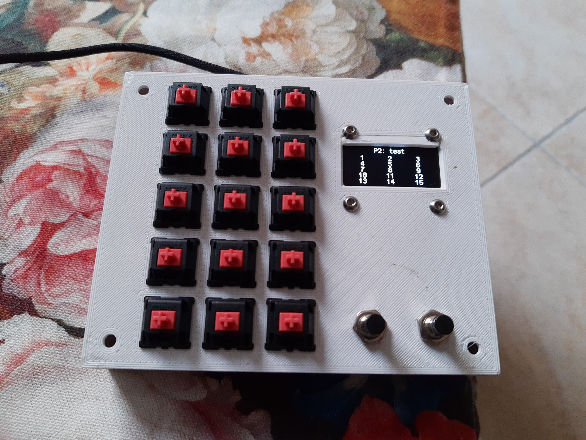
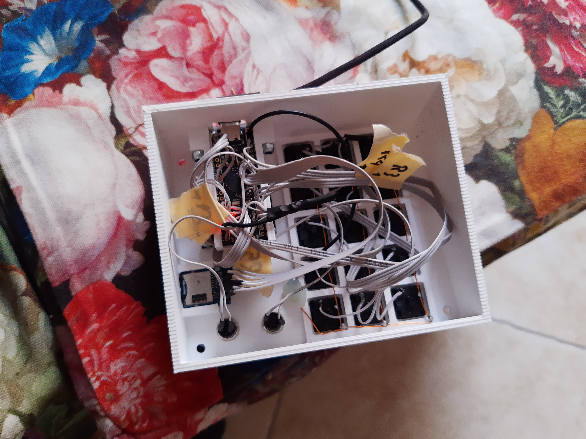

# Ancestors
This is a port of the duckyPad (https://github.com/dekuNukem/duckyPad) to a STM32F4CF411CEU.

I wanted to build it myself but I do not have the means to solder the PCB myself.

# Parts used
- STM32F411CEU (Blackpill): https://de.aliexpress.com/item/4000138305460.html?spm=a2g0s.9042311.0.0.211c4c4diRx1zV
- Micro SD card module: https://www.ebay.de/itm/QITA-MicroSD-Breakout-Board-f%C3%BCr-SD-TF-Karte-f%C3%BCr-Arduino-3-3V-6Pin-CP09009/352884165898?ssPageName=STRK%3AMEBIDX%3AIT&_trksid=p2060353.m2749.l2649
- 1.3" OLED dispaly with PCB: https://www.ebay.de/itm/1-3-Zoll-Arduino-OLED-128x64-Display-SH1106-I2C-IIC-TWI-wei%C3%9F-Raspberry-Pi/253081549017?ssPageName=STRK%3AMEBIDX%3AIT&_trksid=p2060353.m2749.l2649

The soldering was done by hand.

# Pictures

