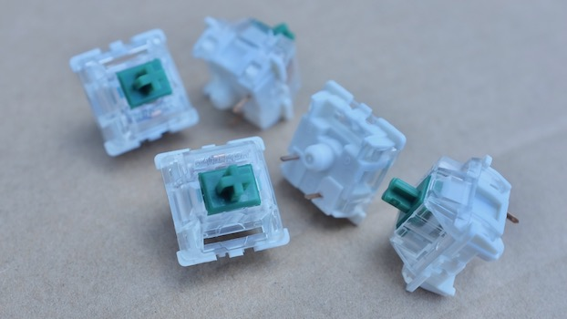
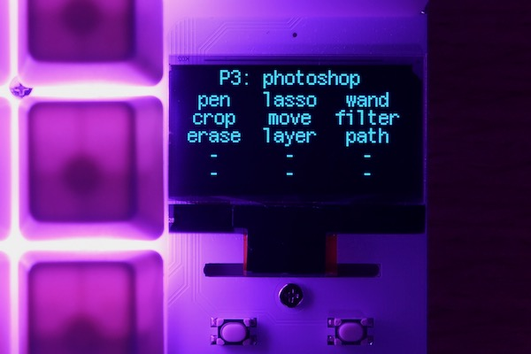
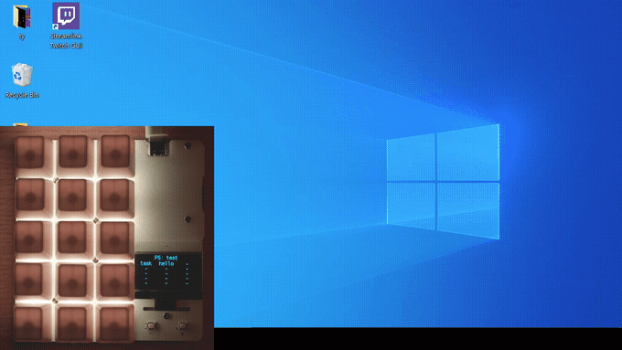
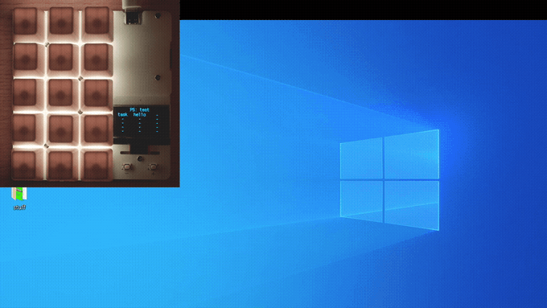
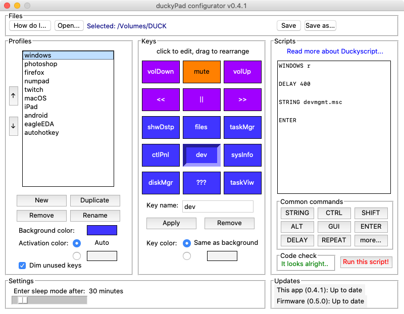
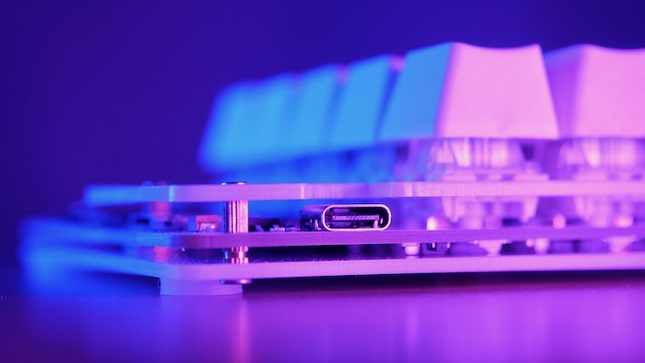

# duckyPad: Do-It-All Mechanical Macropad

[Get duckyPad](https://www.tindie.com/products/21984/) | [Official Discord](https://discord.gg/4sJCBx5) | [Getting Started](getting_started.md) | [Table of Contents](#table-of-contents)

----

duckyPad is a 15-key mechanical macropad that helps **consolidate and speed up your workflow** by automating keyboard inputs. 


duckyPad features a sleek design and all the goodies of a high-end mechanical keyboard:

* Mechanical switches
* **Hot-swap**
* **RGB**
* **USB-C**
* Open-source

But more crucially, duckyPad also features **previous-unseen-in-macropads** innovations such as:

* **OLED** screen showing what each key does
* Sophisticated **multi-line scripting** with [duckyScript](duckyscript_info.md)
* **32 profiles** of 15 keys, 480 macros total.
* microSD card storage, move between devices without losing macros.
* No driver needed, works out-of-box on anything that supports USB keyboards.


When pressed, each key executes a user-created *`duckyScript`* to automate keyboard actions:


The scripts can be as simple as shortcuts like `Control + C`, or as sophisticated as launching applications, managing livestreams, or even [creating root backdoors](https://github.com/hak5darren/USB-Rubber-Ducky/wiki/Payload---OSX-Root-Backdoor) or [grabbing passwords](https://github.com/hak5darren/USB-Rubber-Ducky/wiki/Payload---download-mimikatz%2C-grab-passwords-and-email-them-via-gmail). It's all up to you!

## Get duckyPad on Tindie!

duckyPad is [now available on Tindie!](https://www.tindie.com/products/21984), feel free to grab one there!

And thanks to the interest and support from the [amazing people like you](kickstarter_backers.md)
, the [duckyPad Kickstarter](https://www.kickstarter.com/projects/dekunukem/duckypad-do-it-all-mechanical-macropad) has been a great success! With over 630% funded from 705 backers!

Finally, here's a video of duckyPad in action!
<table>
  <tr>
    <td><a href="https://www.youtube.com/watch?v=dqWWlOURo6A" title="YouTube" rel="noopener"></a></td>
  </tr>
</table>

## Highlights

* 15 Mechanical Switches (Gateron Green by default)
* **`Hot-Swap`** Sockets
* Per-Key **`RGB Lighting`** 
* **`OLED Screen`**, showing profile and key names.
* Powerful multi-line scripting with [duckyScript](duckyscript_info.md).
* 32 profiles of 15 keys, for a total of 480 scripts.
* microSD storage
* USB-C Connector
* Works with all major OSs, no driver needed.
* Multiple keyboard layouts (French, Belgium, German, Dvorak, etc)
* Fully Open Source!

## Showcase

By **`automating commonly used actions with duckyPad`**, you can streamline and speed up your everyday routine. Here are a few examples:

### Photoshop / CAD 

You can put all your commonly used shortcuts in one place, resulting in a more efficient workflow: 


### Managing Livestreams 

With the press of a key, you can switch scenes, start/stop stream, start/stop recording, play ads, and a lot more!


### Security Research

With the ability to automate keyboard inputs, it is possible to take over an entire computer with the push of a button.

This is known as [BadUSB attack](https://arstechnica.com/information-technology/2014/07/this-thumbdrive-hacks-computers-badusb-exploit-makes-devices-turn-evil/), and it was the original purpose of [duckyScript and USB Rubber Ducky](https://shop.hak5.org/products/usb-rubber-ducky-deluxe).

But of course, it's up to you to decide what to do!


### Launching Applications  

You can set up duckyPad to open your favourite app with the press of a button: 


### One-finger Twitch Chat

😉


### Switching Profiles

With all those potential usages, duckyPad supports up to 32 profiles.

Simply press the +/- button to switch between them:


### ... and more!

Those are just some examples! You can use duckyPad to do whatever **`you`** want!

## Features

### Mechanical Switches

duckyPad is compatible with Cherry MX-style mechanical switches (3 or 5-pin).

By default, duckyPad comes with **`Gateron Green`** switches, which are linear and clicky.



Of course, you can also install your own switches!

### Keycaps

By default, duckyPad comes with 15 blank translucent ABS R4 keycaps that complement the RGB backlight in all conditions:


Of course, you can also install your own key caps!

### Hot-swap Sockets

duckyPad supports hot-swapping with Kailh sockets.

You can install/remove the switches by hand, **`no soldering needed`**.


### Per-key RGB backlight

Each key on duckyPad has its own configurable RGB backlight. You can assign them unique colours to suit your needs.

### OLED screen

duckyPad has an OLED screen. It displays current **`profile and key names`**, so you know what each key does at a glance.

* 1.3-inch blue OLED display
* High contrast with true OLED black
* 128 x 64 resolution
* Burn-in prevention



### duckyScript

duckyPad uses [duckyScript](duckyscript_info.md), a scripting language for keyboard automation. It was originally developed for [USB Rubber Ducky](https://shop.hak5.org/products/usb-rubber-ducky-deluxe).

duckyScript is easy and straightforward to write, but can also achieve powerful results.

A simple example would look like this:

`CONTROL SHIFT ESC`

Now when you press a key on duckyPad, it will execute this script and bring up the Task Manager, eliminating the need for memorising and pressing a 3-key combo.



Of course, duckyScript can do much more than that!

Instead of just hotkeys, you can write multi-line scripts for complex keyboard automation tasks.

Here is a multi-line example that open up notepad, types "Hello world", and increases text size:

```
WINDOWS R
DELAY 400
STRING notepad
ENTER
DELAY 400

STRING Hello World!
CONTROL +
REPEAT 10
```

Note how simple and intuitive it is. You can write you own duckyScript very easily to achieve powerful results.



Whether it's for simple hotkeys or multi-line epic, duckyScript is ready to meet all your keyboard automation needs!

### SD Card Storage

duckyPad stores its scripts and settings on a regular microSD card. Compared to other methods:

* MicroSD cards are universal and inexpensive
* Easy to edit and backup
* Up to 64GB supported with FAT32 format


### Companion App

duckyPad comes with a companion app for Windows 10, macOS, and Linux. You can use it to:

* Manage profiles
* Manage key names, colours, and arrangements.
* Write, debug, and test-run duckyScript.
* Change, save, and backup configurations.



But more importantly, duckyPad app **`respects your privacy`**:

* Fully open-source
* No need to create an account
* No data collection whatsoever
* No internet connection required
* You don’t even have to use it! You can [set up your duckyPad manually](./manual_setup.md).

### USB-C and Device Compatibility

duckyPad uses USB-C connector for maximum device compatibility.



You can use duckyPad out-of-box on nearly anything that supports USB keyboards, **`no driver needed`**. Examples include:

* PC
* Mac
* Linux
* Raspberry Pi
* iPhone / iPad
* Android phones and tablets
* Chromebooks
* Game consoles
* and more!


duckyPad’s firmware can also be [easily updated via USB-C](firmware_updates_and_version_history.md) for new features and bug fixes.

### Keyboard Layouts

duckyPad supports multiple keyboard layouts:

* English (US)
* French
* Belgium
* German
* Dvorak
* ...and more [user-created](keymap_instructions.md) layouts!

You can load up to *8 keyboard layouts* to duckyPad and switch them on-the-fly.

### Dimensions

[Click me](pcb/plates) for vector files of front and back plates.

[Click me](resources/pics/dimensions.png) for dimensions drawings.

## I want one!

duckyPad is [now available on Tindie!](https://www.tindie.com/products/21984), feel free to grab one there!

Also consider [joining our discord](https://discord.gg/4sJCBx5) for latest updates and discussions.

## Press Kit / More Photos

[Click me](https://drive.google.com/drive/folders/1unbhvTEYcIKlmMEPPsL88o1tNOvzpQyo?usp=sharing) to download some high-resolution photos of duckyPad, feel free to share them.

## Getting started

Please see [the instruction manual](./getting_started.md) on how to use your duckyPad.

## Making one yourself

Please see [this guide](./build_it_yourself.md).

## Derivatives

A number of projects are based on duckyPad, they are listed here!

* simonCor ported this project to a [STM32F4 black pill](https://github.com/simonCor/poor-mans-ducky-pad), with hand-soldered connections and 3D-printed case, very neat!

* headslash is working on [Frankenduck](https://github.com/headslash/Frankenduck), with redesigned PCB, 3D-printed case, and extra switches.

## Table of Contents

[Main page](README.md)

[Getting Started Guide](getting_started.md)

[Kit Assembly Guide](kit_assembly_guide.md)

[Using duckyScript](duckyscript_info.md)

[Common issues / Troubleshooting](troubleshooting.md)

[Firmware Updates and Version History](firmware_updates_and_version_history.md)

[Make Your Own Keymap](./keymap_instructions.md)

[Manual Setup](./manual_setup.md)

[Build a duckyPad Yourself](build_it_yourself.md)

[Kickstarter Backer Acknowledgments](kickstarter_backers.md)

## Questions or Comments?

Please feel free to [open an issue](https://github.com/dekuNukem/duckypad/issues), ask in the [official duckyPad discord](https://discord.gg/4sJCBx5), DM me on discord `dekuNukem#6998`, or email `dekuNukem`@`gmail`.`com` for inquires.
