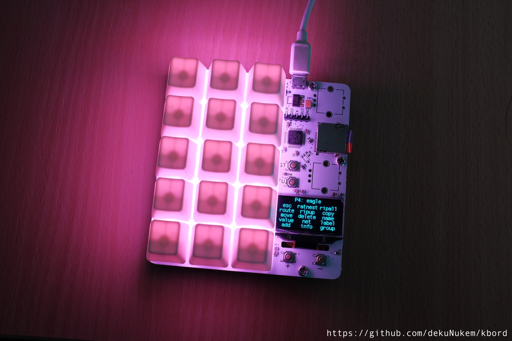
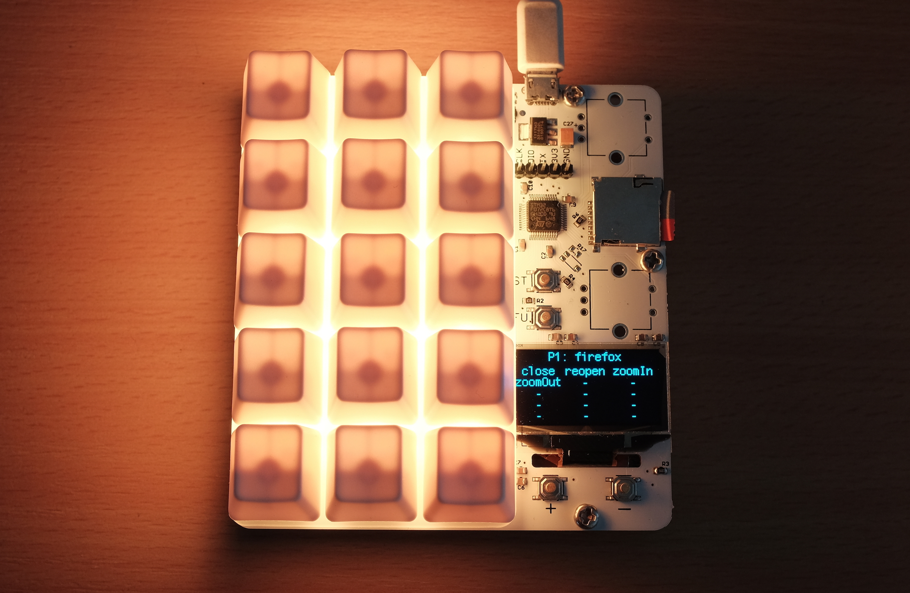
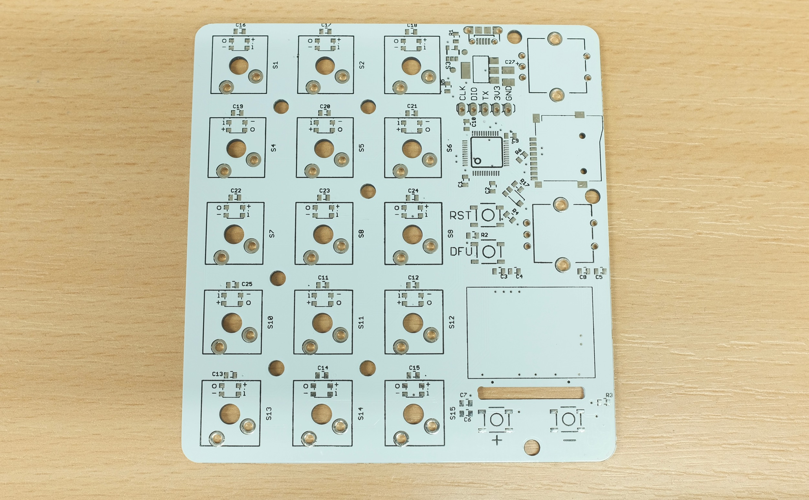
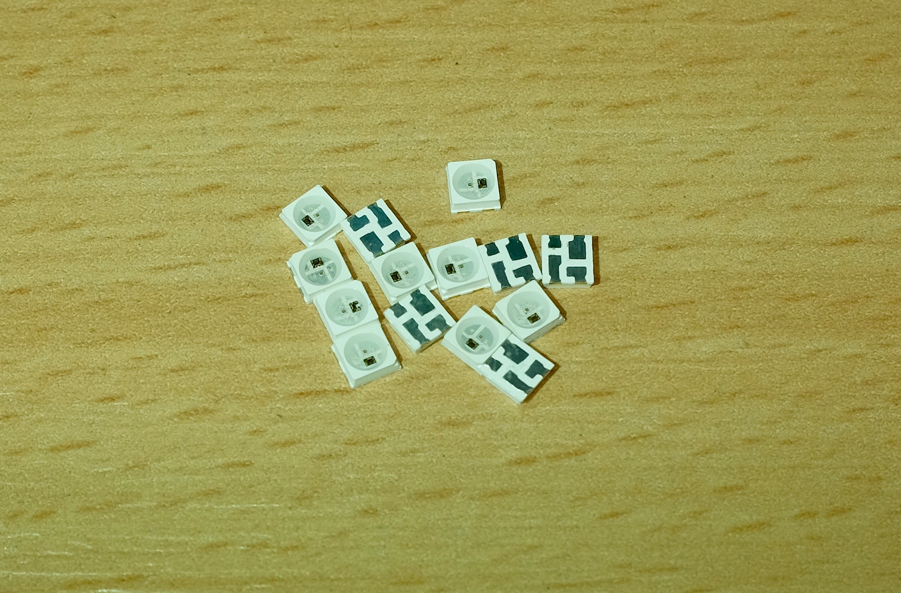

# kbord: Programmable Mechanical Keypad with RGB Backlight



kbord is a programmable keypad with 15 mechanical keys, each of which can be set to execute a script when pressed.

The script can be as simple as shortcut keys like ctrl+c, or as complex as [creating root backdoors](https://github.com/hak5darren/USB-Rubber-Ducky/wiki/Payload---OSX-Root-Backdoor) or [grabbing passwords](https://github.com/hak5darren/USB-Rubber-Ducky/wiki/Payload---download-mimikatz%2C-grab-passwords-and-email-them-via-gmail). Anything that can be done on keyboard can be written in the script.

Multiple profiles are supported, for different programs/environments.

## Features

* 15 mechanical switches
* Individually addressable RGB backlights with animations
* OLED screen displaying current profile and key functions
* SD card script storage
* Standard duckyscript parsed onboard
* Multiple profiles supported

## Questions?

Feel free to ask in the issue section, or email me at `dekunukem__gmail__com`.

## Usage

### Step 1: Preparing profiles

Profiles are created as folders, with naming conventions like `profile#_name`, where `#` is the profile number, and `name` being the name of the profile. Here are some examples:


### Step 2: Preparing scripts

Now you're ready to write some scripts inside the profile folders. The script used in this project is Duckyscript, [click here to read its usage](https://github.com/hak5darren/USB-Rubber-Ducky/wiki/Duckyscript).

Each key has its own script file, named like `key#_name.txt`, where `#` is the key number(top left is 1, bottom right is 15), and `name` is a short description of what that key does. 

Here are some examples:


The screen will only display the first 7 characters of the key name, so keep it short!

### Step 3: (OPTIONAL) Set backlight color

This step is optional, but who would want to pass that? It's RGB after all.

Just create file named `config.txt` and set its content like this 
```
BG_COLOR 255 100 0
KEYDOWN_COLOR 100 0 255
```
BG_COLOR is the background color, the following numbers are value of the color that you can change, between 0 and 255, in the order of R-G-B.

Similarly, KEYDOWN_COLOR is the color for the key to change to when you press it down.

The content of the profile folder should now look like this:


If you skip this step the default backlight color would be light blue.

### Step 4: Run it!

Format a SD card in FAT32, put all the profile folders in the root of the SD card, and insert it in the SD slot.

kbord should start up with the first profile, displaying the profile names and key names, as well as the background color:



Press the corresponding keys to execute their scripts, if there is an error it will show up on the screen.

Press + - button on the lower right to change profiles.

### More examples!

[See here](sample_SD_card) for some profiles that has been already set up. You can start from there and make changes to suit your need.

## Making one yourself

Here are some things to keep in mind if you're making one yourself:

### Circuit board

The board is a simple 2-layer board with a cutout for the OLED screen in the milling layer, some board fabs might ignore that layer, so be careful.



Getting a stencil is strongly recommended, because the RGB LED used here WILL melt if you try to solder it with a regular soldering iron. It's best to use a stencil and then reflow it in an oven.

Speaking of which...

### RGB LED

The RGB LED is the trusty WS2812 that's thrown into every single RGB project these days, except it isn't: What I used is SK6812 which is a compatible clone with [allegedly better performance](https://hackaday.com/2017/01/25/ws2812b-led-clones-work-better-than-originals/). It is also the smaller 3535 package, not the regular 5050 kind, so do watch out for that.



I haven't tested WS2812 with the design, it should work on paper, but I suggest just get some 3535 SK6812 and be done with it.

### Switches

In theory you can use any cherry MX style 3-pin switches you like, however, because there are backlights underneath, you need to find one that has an opening for the LED, and has a clear case to let the light shine through.

I used Gateron RGB switches, they are perfectly designed for this kind of usage, translucent case with a large opening for LED. I used greens but there are other colors to choose from as well.


A switch plate is strongly recommended, to improve stability and even out the backlight. I had mine laser cut with a diffuser material.


### Keycaps

I bought some blank white keycaps, just make sure they don't block the backlight.

### Misc

Remember to make sure the entire board is working, as well as install the standoffs before you solder the switches in place, otherwise it would be almost impossible to get them off again.