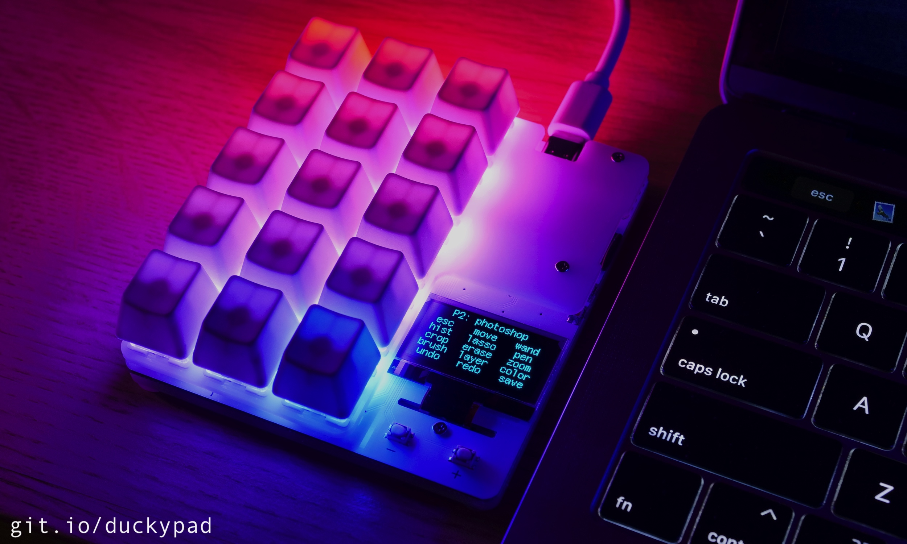
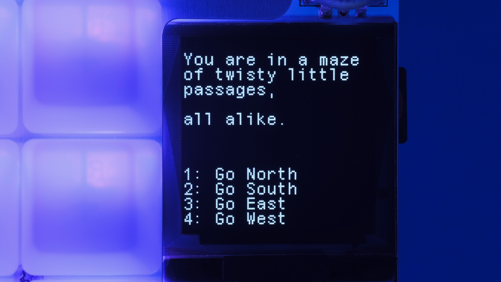
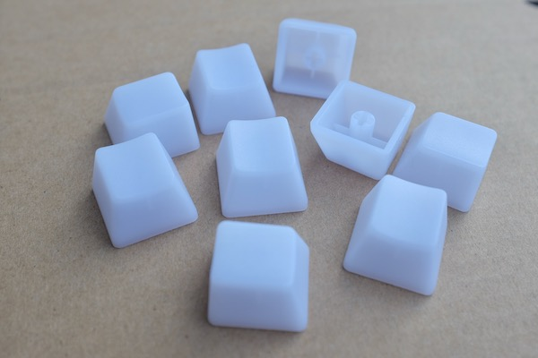
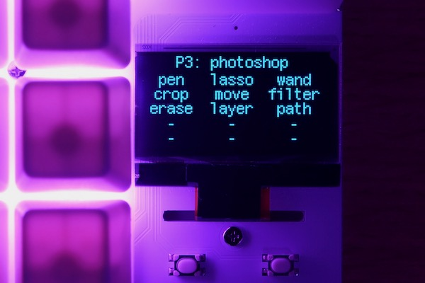
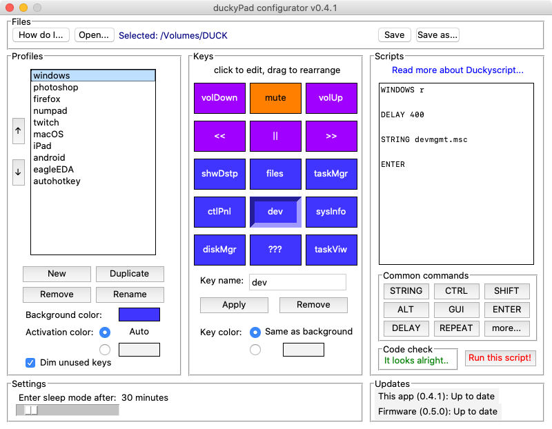
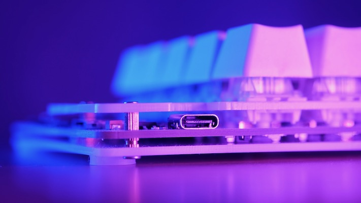

# duckyPad: Do-It-All Mechanical Macropad

[Get duckyPad](https://dekunukem.github.io/duckyPad-Pro/doc/landing.html) | [Official Discord](https://discord.gg/4sJCBx5) | [Getting Started](getting_started.md) | [Table of Contents](#table-of-contents)

----

duckyPad is a 15-key **mechanical macropad** for power users who demand **advanced macro scripting and customisation** beyond the shackles of QMK/VIA.



Using a [turing-complete scripting language](https://dekunukem.github.io/duckyPad-Pro/doc/duckyscript_info.html), you can automate **any keyboard/mouse input** you want, from **simple combos** to **full-blown programs**.

## Get One

duckyPad was successfully [funded on Kickstarter](https://www.kickstarter.com/projects/dekunukem/duckypad-do-it-all-mechanical-macropad) thanks to the [amazing backers!](kickstarter_backers.md)

* Now Available [on my Tindie Store](https://www.tindie.com/products/dekunukem/duckypad-do-it-all-mechanical-macropad/)

## Highlights

duckyPad has all the basics:

* **Hot-swap**
* Per-key RGB
* Fully **open-source**

But also unique features **not seen anywhere else**:

* Custom **[duckyScript](https://dekunukem.github.io/duckyPad-Pro/doc/duckyscript_info.html)** engine, **NOT QMK/VIA**.
* **Longer and more complex** macros
* **OLED** screen
* **32 profiles** of 15 keys, 480 macros total.
* [Automatic profile switching](https://github.com/dekuNukem/duckyPad-profile-autoswitcher) based on active window.
* microSD storage, move between devices with ease.
* No proprietary drivers, works out-of-box.


## duckyScript vs QMK/VIA

duckyPad uses **duckyScript**, originally designed for [USB Rubber Ducky](https://shop.hak5.org/products/usb-rubber-ducky-deluxe).

Compared to QMK/VIA, you get:

* **Much Longer Macros**
	* [Entire Bee Movie](resources/beemovie.txt) in one macro? Yes please!
	* Up to 480 macros

* **Turing-Complete Scripting**
	* Variables, conditions, loops, functions, and more.
	* Executed on [32-bit Bytecode VM](https://duckypad.github.io/DuckStack/)
	* With **Scratch** and **Non-volatile Memory**

* **Advanced Interactions**
	* Reading Buttons
	* Print to OLED screen
	* Change RGB Color

* **SD Card Storage**
	* Fast Configuration / Backup / Deployment
	* No sketchy drivers or apps
	* No recompiling

While QMK/VIA are great for regular keyboards, they are rather limited at input automations.

duckyScript is a no-brainer for **power users** with more demanding scripting needs.

## 🆕 duckyPad Pro

duckyPad Pro is an updated model with:

* Rotary Encoders
* More Keys
* Bluetooth
* Bigger Display
* More Script Storage
* Expansion Module

👉👉👉 [Purchase Link](https://www.tindie.com/products/37399/) | [More Info](https://dekunukem.github.io/duckyPad-Pro/)


## Discord Community

Feel free to join our [Official Discord](https://discord.gg/4sJCBx5) for discussions, questions, sharing scripts, and latest updates!

## How It Works / Showcase

* Create up to **32 profiles**, one for each application.

* Assign up to **15 keys** per profile

* Names are shown on OLED screen

* Write a **duckyScript** for each key

### Easy Start

* **duckyScript** is a language for automating inputs

	* At simplest, you just tell it **what key to press!**

* Such as **key combos** of your favorite app

`CTRL a` , `CTRL +`, etc.


### Up a Notch

* Once familiar, you can write **longer multi-line macros** to further speed up everyday task.

* Such as **filling forms** and typing **boilerplate text** with one keypress.

```
STRING Michael Scott
TAB
STRING United States
ENTER
STRING 5705550100
TAB
STRING michael.scott@dundermifflin.com
TAB
```


Or a simple mouse jiggler:

```
WHILE TRUE
	MOUSE_MOVE $_RANDOM_INT $_RANDOM_INT
	DELAY 100
END_WHILE
```


### Full Potential

* Going all-out, duckyScript is a **Turing-Complete** **general-purpose** language.
* You can use it to:
	* Read Buttons
	* Write to OLED screen
	* Change RGB colors
	* Perform operations with **32-bit variables**, **conditions**, **loops**, **function call**s, and more!
* Write ultra-specific macros for your exact needs

```
RGB_SET 1 128 0 255

OLED_PRINT You are in a maze
OLED_PRINT of twisty little passages

VAR choice = _READKEY

IF choice == 1
    OLED_CURSOR 0 10
    OLED_PRINT It is a dead end.
    OLED_PRINT Something moves
    OLED_PRINT behind you.
END_IF
```



### Hackerman

* Of course, by automating HID inputs, you can take over an entire computer with the push of a button!


* This is known as [BadUSB attack](https://arstechnica.com/information-technology/2014/07/this-thumbdrive-hacks-computers-badusb-exploit-makes-devices-turn-evil/), and was the original purpose of [USB Rubber Ducky](https://shop.hak5.org/products/usb-rubber-ducky-deluxe).

---------

### Nothing Like It

* From **simple shortcuts** to **full-blown programs**, duckyScript can easily achieve what was impossible on QMK/VIA.

* Each macro can contain over **50,000 characters**

* Store **480 macros** in total

* Executed on custom [virtual stack machine](https://duckypad.github.io/DuckStack/)

## Features

### Switches & Keycaps

duckyPad is compatible with Cherry MX-style mechanical switches (3 or 5-pin).

By default, duckyPad comes with blank translucent ABS R4 keycaps:



You can use your own as well.

### Hot-swap Sockets

duckyPad supports hot-swapping with Kailh sockets.

You can install/remove the switches by hand, **`no soldering needed`**.

### Per-key RGB backlight

Each key on duckyPad has its own RGB backlight. User-configurable colour & brightness.

### OLED screen

duckyPad has an OLED screen. It displays current **`profile and key names`**, so you know what each key does at a glance.

* 128x128
* 1.3 inch
* High contrast with true black
* Burn-in Prevention



### Companion App

[Use the open-source configurator](https://github.com/duckyPad/duckyPad-Configurator) to set up your duckyPad Pro.

* Windows | Mac | Linux
* No account / subscription needed
* No data collection / telemetry



## Profile Auto-switching

* [Automatically jump to the appropriate profile](https://github.com/dekuNukem/duckyPad-profile-autoswitcher)
* Based on **current active window**

### USB-C and Device Compatibility

duckyPad uses USB-C connector for maximum device compatibility.



You can use duckyPad out-of-box on pretty much anything that supports USB keyboards, **`no driver needed`**. Examples include:

* PC
* Mac
* Linux
* Raspberry Pi
* iPhone / iPad
* Android phones and tablets
* Chromebooks
* Game consoles

duckyPad’s firmware can also be [easily updated via USB-C](firmware_updates_and_version_history.md) for new features and bug fixes.

### Keyboard Layouts

duckyPad supports multiple keyboard layouts:

* English (US)
* English (UK)
* French
* Belgium
* German
* Dvorak
* ...and more [user-created](keymap_instructions.md) layouts!

### Dimensions

[Click me](pcb/plates) for vector files of front and back plates.

[Click me](resources/pics/dimensions.png) for dimensions drawings.

## Getting Started

Please see [the instruction manual](./getting_started.md) on how to use your duckyPad.

## I Want One!

duckyPad is [now available on Tindie.](https://www.tindie.com/products/21984)

Also consider [joining our discord](https://discord.gg/4sJCBx5) for latest updates and discussions.

## Table of Contents

[Main page](README.md)

[Getting Started Guide](getting_started.md)

[Kit Assembly Guide](kit_assembly_guide.md)

[Using duckyScript](https://dekunukem.github.io/duckyPad-Pro/doc/duckyscript_info.html)

[Common issues / Troubleshooting](troubleshooting.md)

[Firmware Updates and Version History](firmware_updates_and_version_history.md)

[Make Your Own Keymap](./keymap_instructions.md)

[Build a duckyPad Yourself](build_it_yourself.md)

[Kickstarter Backer Acknowledgments](kickstarter_backers.md)

## Questions or Comments?

Please feel free to [open an issue](https://github.com/dekuNukem/duckypad/issues), ask in the [official duckyPad discord](https://discord.gg/4sJCBx5), DM me on discord `dekuNukem#6998`, or email `dekuNukem`@`gmail`.`com` for inquires.
