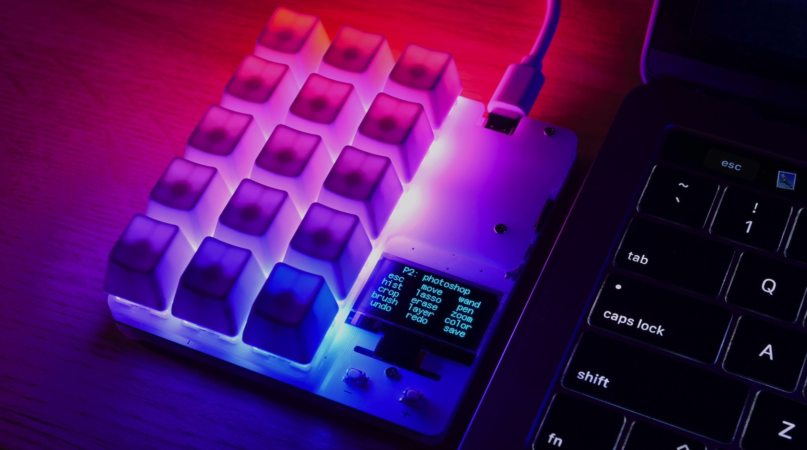

# duckyPad: Do-It-All Mechanical Macropad

[Get duckyPad](https://www.tindie.com/products/21984/) | [Official Discord](https://discord.gg/4sJCBx5) | [Getting Started](getting_started.md) | [Table of Contents](#table-of-contents)

----

duckyPad is a 15-key mechanical macropad that helps **consolidate and speed up workflow** by automating keyboard/mouse inputs. 



It has all the basics:

* **Hot-swap**
* Per-key RGB
* USB-C
* Fully Open-source

But also features **not seen anywhere else**:

* Configurable **OLED** screen
* Custom **[duckyScript](duckyscript_info.md)** engine, **NOT QMK/VIA**.
* Much **longer and sophisticated** macros
* **32 profiles** of 15 keys, 480 macros total.
* [Automatic profile switching](https://github.com/dekuNukem/duckyPad-profile-autoswitcher) based on active window.
* microSD storage, move between devices with ease.
* No proprietary drivers, works out-of-box.


When pressed, each key executes a [duckyScript](duckyscript_info.md) macro.

It can be as simple as shortcuts like `Ctrl + C`, or as complex as filling forms, launching applications, or even [creating root backdoors](https://shop.hak5.org/blogs/usb-rubber-ducky/the-3-second-reverse-shell-with-a-usb-rubber-ducky) or [grabbing passwords](https://shop.hak5.org/blogs/usb-rubber-ducky/15-second-password-hack-mr-robot-style). It's all up to you!

## duckyScript vs QMK/VIA

duckyPad uses **duckyScript**, of [USB Rubber Ducky](https://shop.hak5.org/products/usb-rubber-ducky-deluxe) fame.

Compared to QMK/VIA, you get:

* **Much Longer Macros**
	* [Entire Bee Movie](resources/beemovie.txt) in one macro? Yes please!
	* Up to 480 in total!

* **Sophisticated Interactive Scripting**
	* Keyboard, Mouse, and Media Keys.
	* Variables, `IF` statements, loops, functions, etc.
	* Reading Buttons
	* Print to OLED screen
	* Change RGB Color

* **Local Storage**
	* Everything stored on SD card
	* Quick configuration / Backup / Duplication
	* No sketchy drivers or apps

* **Existing Resources**
	* Lots of [scripts](https://github.com/hak5/usbrubberducky-payloads) to try out
	* Thriving [Discord](https://discord.gg/4sJCBx5) community!

While QMK/VIA are great for regular keyboards, they are rather hopeless at even the bare minimum of input automation.

duckyScript is no-brainer if you're serious about macro scripting!

## Get duckyPad

duckyPad is [now available on Tindie](https://www.tindie.com/products/21984)!

And thanks to the interest and support from the [amazing people like you](kickstarter_backers.md), the [Kickstarter campaign](https://www.kickstarter.com/projects/dekunukem/duckypad-do-it-all-mechanical-macropad) has been a great success!

## Discord Community

Feel free to join our [Official Discord](https://discord.gg/4sJCBx5) for discussions, questions, sharing scripts, and latest updates!

## Showcase

By **`automating frequently-used actions`**, you can streamline and speed up your daily routine.

A few examples:

### Launching Applications  

Open your favorite app with the press of a button: 


### Managing Livestreams 

Switch scenes, start/stop stream, start/stop recording, play ads, and a lot more!


### Security Research

By automating *1337 scriptz*, you can take over an entire computer with the push of a button.

This is known as [BadUSB attack](https://arstechnica.com/information-technology/2014/07/this-thumbdrive-hacks-computers-badusb-exploit-makes-devices-turn-evil/), and was the original purpose of [USB Rubber Ducky](https://shop.hak5.org/products/usb-rubber-ducky-deluxe).

But of course, it's up to you to decide what to do!


### Photoshop / CAD 

Put all your shortcuts in one place, makes things faster: 


### One-finger Twitch Chat

no need to explain this one


### Switching Profiles

With all the potential usages, duckyPad supports up to 32 profiles.

Simply press the +/- button to switch between them, or use the [profile autoswitcher](https://github.com/dekuNukem/duckyPad-profile-autoswitcher) to **switch automatically** based on **current active window**.


### ... and more!

Those are just some examples! You can use duckyPad to do whatever **`you`** want!

## Features

### Mechanical Switches

duckyPad is compatible with Cherry MX-style mechanical switches (3 or 5-pin).

duckyPad comes with **`Gateron Green`** or **`Kalih BOX Navy`** switches, both of which are firm and clicky.

Of course, you can also install your own!

### Keycaps

By default, duckyPad comes with blank translucent ABS R4 keycaps:


Again, you can use your own as well.

### Hot-swap Sockets

duckyPad supports hot-swapping with Kailh sockets.

You can install/remove the switches by hand, **`no soldering needed`**.


### Per-key RGB backlight

Each key on duckyPad has its own RGB backlight. You can assign unique colours to suit your needs.

### OLED screen

duckyPad has an OLED screen. It displays current **`profile and key names`**, so you know what each key does at a glance.

* 1.3-inch blue OLED display
* High contrast with true OLED black
* 128 x 64 resolution
* Burn-in prevention


### duckyScript

duckyPad uses **duckyScript** for keyboard automation. 

It is powerful, but also easy and straightforward to write.

A simple example look like this:

`CONTROL SHIFT ESC`

When you press a key, it will bring up the Task Manager, no need for memorising the 3-key combo.


Of course, it can do much more!

A multi-line example that open up notepad, types "Hello world", and increases text size:

```
WINDOWS R
DELAY 400
STRING notepad
ENTER
DELAY 400

STRING Hello World!
CONTROL +
REPEAT 10
```


See the [full guide here](duckyscript_info.md).

### Companion App

duckyPad comes with a companion app for Windows 10, macOS, and Linux. You can use it to:

* Manage profiles
* Manage key name, color, and arrangements.
* Write and debug duckyScript.
* Change, save, and backup configurations.


But more importantly, duckyPad app **`respects your privacy`**:

* Fully open-source
* No need to create an account
* No data collection whatsoever
* No internet connection required
* You don't even have to use it! You can [set up your duckyPad manually](./manual_setup.md).

### USB-C and Device Compatibility

duckyPad uses USB-C connector for maximum device compatibility.


You can use duckyPad out-of-box on pretty much anything that supports USB keyboards, **`no driver needed`**. Examples include:

* PC
* Mac
* Linux
* Raspberry Pi
* iPhone / iPad
* Android phones and tablets
* Chromebooks
* Game consoles

duckyPad’s firmware can also be [easily updated via USB-C](firmware_updates_and_version_history.md) for new features and bug fixes.

### Keyboard Layouts

duckyPad supports multiple keyboard layouts:

* English (US)
* English (UK)
* French
* Belgium
* German
* Dvorak
* ...and more [user-created](keymap_instructions.md) layouts!

### Dimensions

[Click me](pcb/plates) for vector files of front and back plates.

[Click me](resources/pics/dimensions.png) for dimensions drawings.

## I want one!

duckyPad is [now available on Tindie.](https://www.tindie.com/products/21984)

Also consider [joining our discord](https://discord.gg/4sJCBx5) for latest updates and discussions.

## Press Kit / More Photos

[Click me](https://drive.google.com/drive/folders/1unbhvTEYcIKlmMEPPsL88o1tNOvzpQyo?usp=sharing) to download some high-resolution photos of duckyPad, feel free to share them.

## Getting started

Please see [the instruction manual](./getting_started.md) on how to use your duckyPad.

## Making one yourself

Please see [this guide](./build_it_yourself.md).

## Derivatives

A number of projects are based on duckyPad, they are listed here!

* simonCor ported this project to a [STM32F4 black pill](https://github.com/simonCor/poor-mans-ducky-pad), with hand-soldered connections and 3D-printed case, very neat!

* headslash is working on [Frankenduck](https://github.com/headslash/Frankenduck), with redesigned PCB, 3D-printed case, and extra switches.

## Table of Contents

[Main page](README.md)

[Getting Started Guide](getting_started.md)

[Kit Assembly Guide](kit_assembly_guide.md)

[Using duckyScript](duckyscript_info.md) | [duckyScript 3 Info](duckyscript3_instructions.md)

[Common issues / Troubleshooting](troubleshooting.md)

[Firmware Updates and Version History](firmware_updates_and_version_history.md)

[Make Your Own Keymap](./keymap_instructions.md)

[Build a duckyPad Yourself](build_it_yourself.md)

[Kickstarter Backer Acknowledgments](kickstarter_backers.md)

## Questions or Comments?

Please feel free to [open an issue](https://github.com/dekuNukem/duckypad/issues), ask in the [official duckyPad discord](https://discord.gg/4sJCBx5), DM me on discord `dekuNukem#6998`, or email `dekuNukem`@`gmail`.`com` for inquires.
