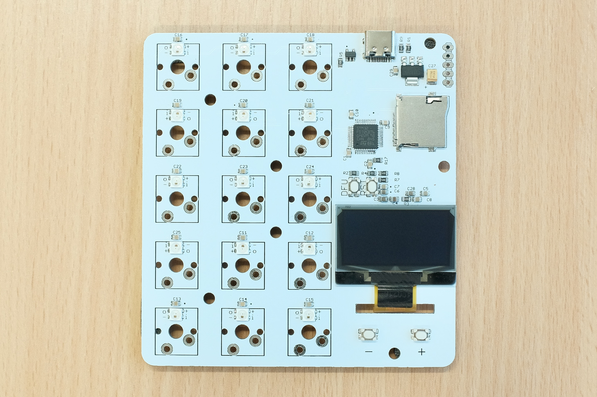
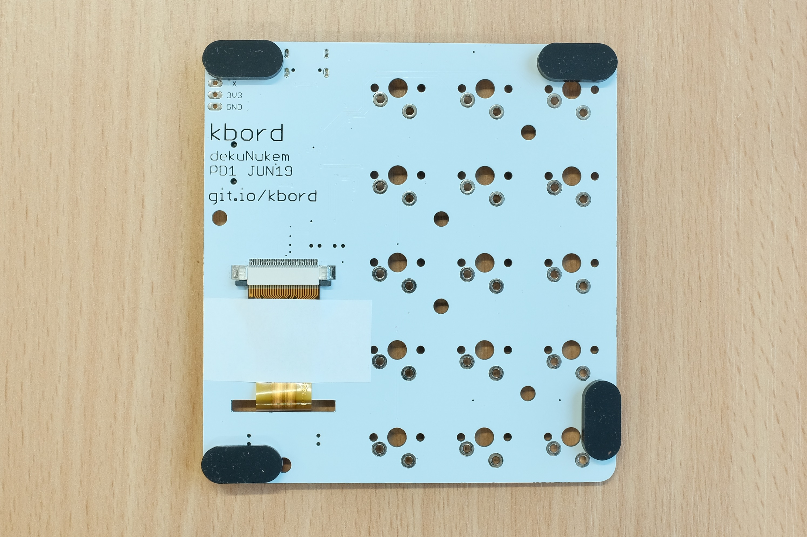
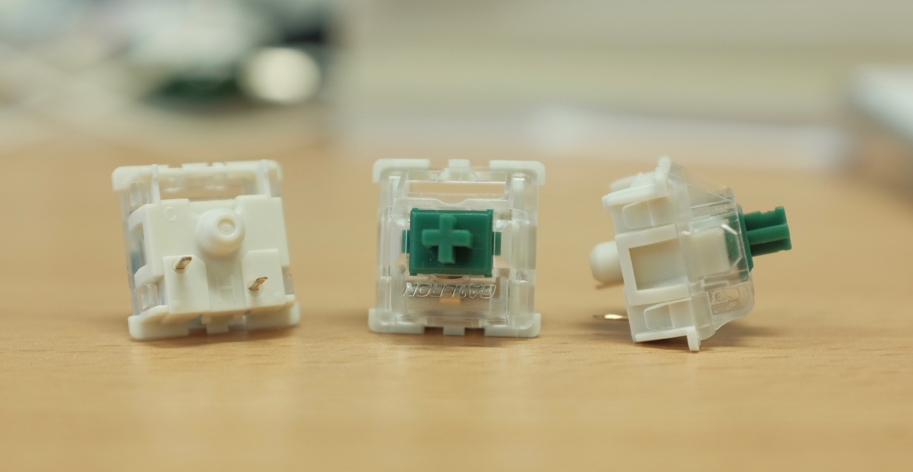
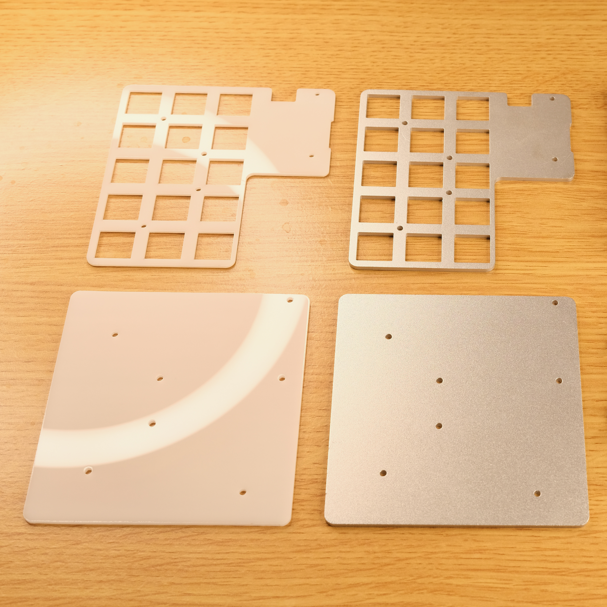
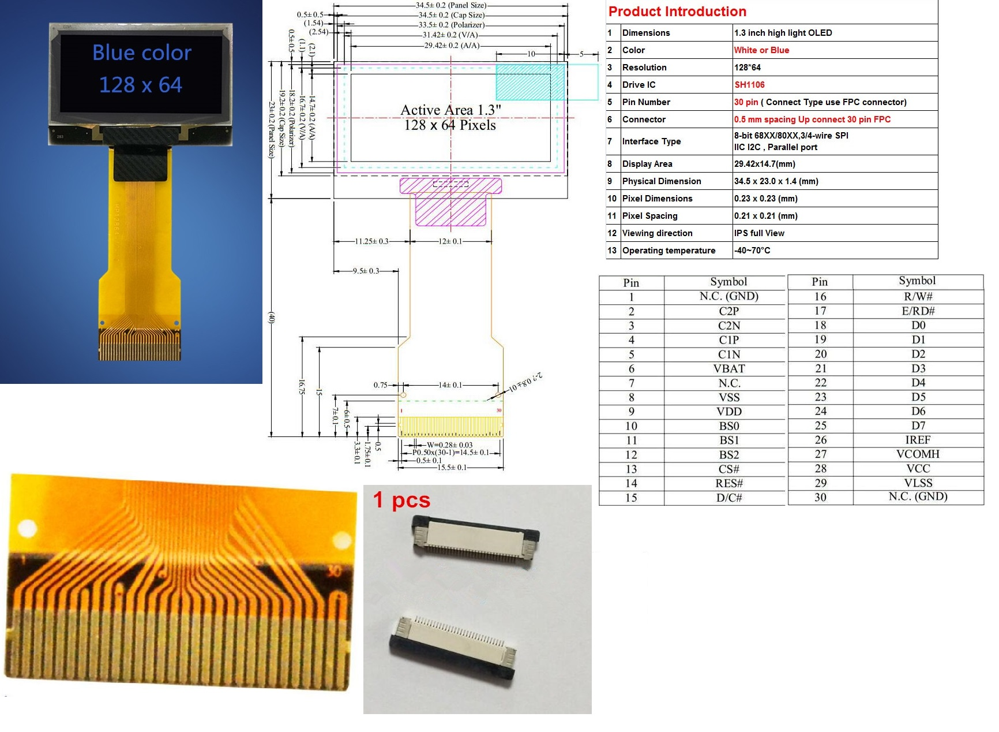
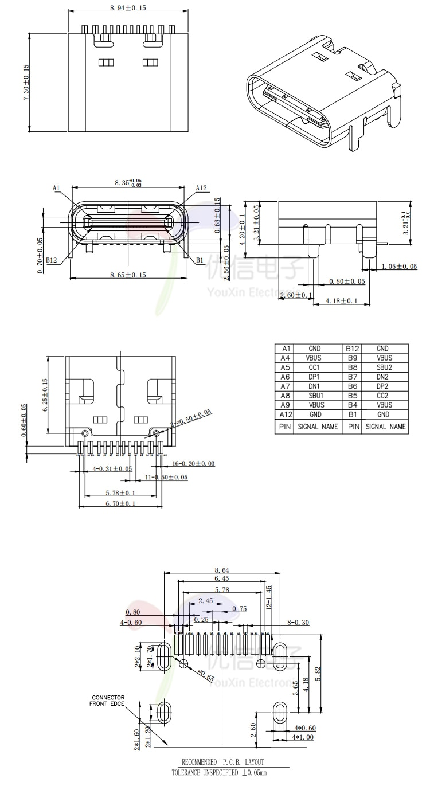
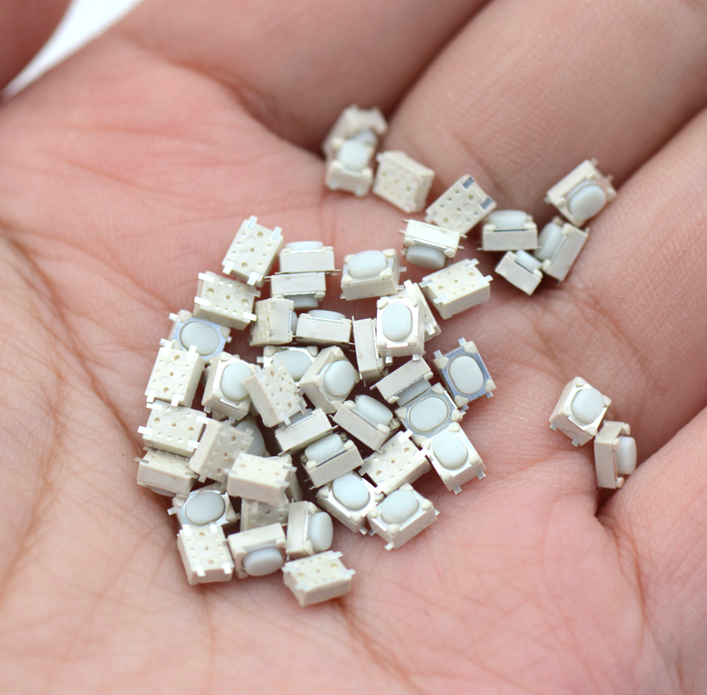

# Making a duckypad yourself

BOM is [here](/pcb/duckypad_v2_bom.xlsx), a video with build process is [here](https://www.youtube.com/watch?v=EGLLCtRuEuM).

Here are some things to keep in mind if you're making one yourself:

## Circuit board

The board is a simple 2-layer board. Don't forget the cutout for the OLED screen in the milling layer!

Getting a stencil is highly recommended, because the RGB LED used here WILL melt if you try to hand-solder. It's best to use a stencil and then reflow it in an oven.

Speaking of which...

## RGB LED

The RGB LED is the trusty WS2812 that's thrown into every single RGB project these days, except it isn't. What I used is SK6812, a compatible clone with [allegedly better performance](https://hackaday.com/2017/01/25/ws2812b-led-clones-work-better-than-originals/). It is also the smaller 3535 package, not the regular 5050 kind, so make sure to get the right part.

I haven't tested WS2812 with the design, it should work on paper, but I suggest just get some 3535 SK6812 and be done with it.

**Careful with the orientation while placing them!** Look at the PCB photo above for details.

## Switches

In theory you can use any cherry MX style switches you like, however, because there are backlights underneath, it's best if you can find one that lets the light shine through.

I used Gateron RGB switches, they are perfectly designed for this kind of usage, translucent case with a large opening for LED. I used greens but there are other colors to choose from as well.

A switch plate is strongly recommended, to improve stability and even out the backlight. I used a laser-cut white 2mm acrylic plate.

## OLED

I used a 1.3 inch OLED display from aliexpress. Make sure the connector is `30pin FPC with 0.5mm pin spacing`.

Note that the FPC connector used here is upper-contact variant. Here are some sample listings (illustration purpose only, you don't have to buy from them):

https://www.aliexpress.com/item/32950730252.html

https://www.aliexpress.com/item/4000350633981.html

Datasheet:

## Keycaps

I bought some blank R4 keycaps, just make sure they don't block the backlight.

## USB Type-C connector

Search `USB 16p` on aliexpress for the connector. Should look like this:

Datasheet:

## Tactile Buttons

Try searching `3X4X2.5MM White Tactile Button` on aliexpress.

Should look like this:

## Misc

To prevent OLED ribbon cable snagging on things, tape it down to the back of the circuit board.

Remember to make sure the entire board is working before you solder the switches in place, otherwise it would be almost impossible to get them off again.

## Technical notes

The microcontroller used here is a STM32F072C8T6. It costs less than a dollar, has more peripherals, pins, and is faster than any old Aduinos. ST provides a free Keil MDK license for all F0 parts, and there are also completely open source toolchains like arm-gcc.

One interesting design detail is the RGB LED. The WS2812(and its clones) requires a rather high data rate, and Arduino library achieve this by bitbanging in assembly. However the ARM processor in STM32 have some funky pipeline and caches, making asm timing somewhat unreliable. As a result I used SPI for LED control. By selecting the right speed and the right data on the MISO line, you can have the waveform look exactly like what WS2812 requires. In this case sending 0xf8 at 8MHz is bit 1, and sending 0xc0 results in a bit 0. Since SPI is also used by SD card, an AND gate is added to insulate the LED data line when SD card is active.