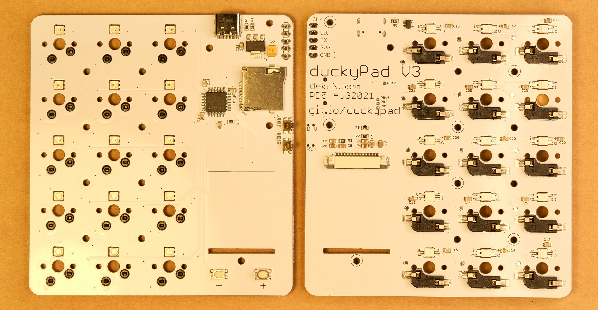
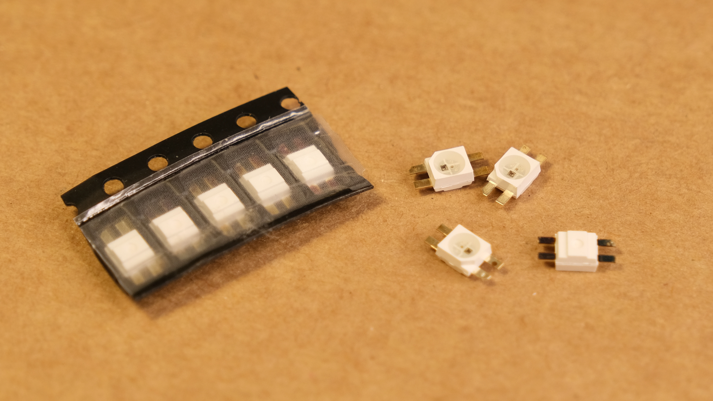
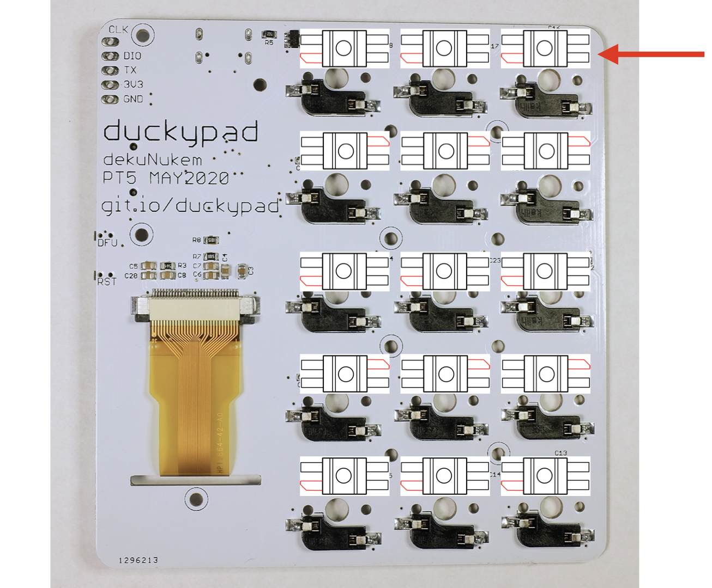
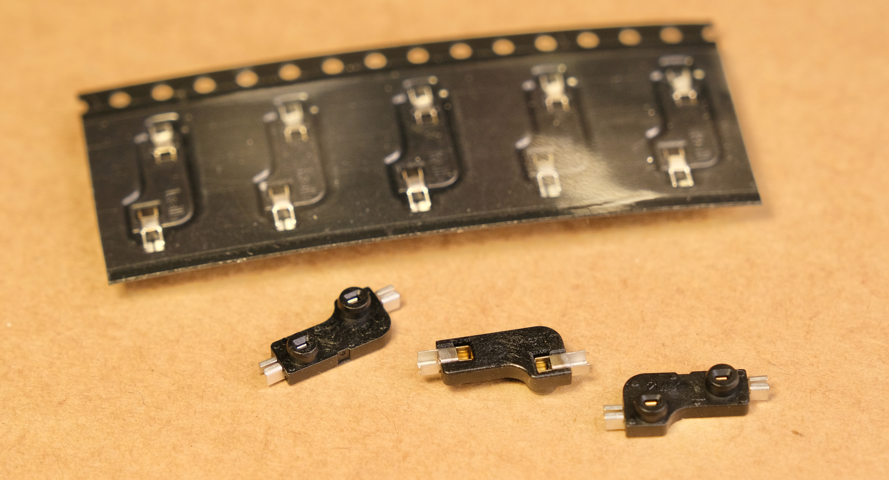

# Make a duckyPad Yourself!

[Get duckyPad](https://www.tindie.com/products/21984/) | [Official Discord](https://discord.gg/4sJCBx5) | [Getting Started](getting_started.md) | [Table of Contents](#table-of-contents)

------

Unless you have prior experience with PCB assembly and already have the equipments, it is most likely cheaper to just [get one ready-made](https://www.tindie.com/products/21984/), but if you fancy a challenge, read on!

If you are handy with PCBs and surface mount soldering, you can make a duckyPad yourself!

* [PCB files](pcb)

* [BOM](https://docs.google.com/spreadsheets/d/e/2PACX-1vT7gMnYGDWy0Lo6eYjwrsN8QOGCtDGLZ2JMhllytPXIBBvnaAoaImIb5qIXtS9drMGxFIuWi2RhF3QB/pubhtml)

Some things to keep in mind:

## Circuit board

The board is a simple 2-layer board. Don't forget the cutout for the OLED screen in the milling layer!

## RGB LED

The RGB LED is [SK6812 MINI-E](https://hackaday.com/2020/01/28/new-part-day-sk6812-mini-e-a-hand-solderable-neopixel-compatible-led/). 

It is **reverse mount**, and pay attention to the orientation!

## Switches

In theory you can use any cherry MX style switches you like, however, because there are backlights underneath, it's best if you can find one that lets the light shine through.

I've used Gateron RGB and Kalih BOX switches, they are both perfectly designed for this kind of usage, translucent case with large opening for LED. I like them clicky, but there are plenty of colors to choose from.

## Hot Swap Sockets

I used Kalih hot-swap sockets for Cherry MX switches:

## Mounting Plates

[Click me](pcb/plates) for vector files of front and back plates.

[Click me](resources/pics/dimensions.png) for dimensions drawings.

You can have them made in laser-cut acrylic or metal.

## OLED

I used a 1.3 inch OLED display from aliexpress. Make sure the connector is `30pin FPC with 0.5mm pin spacing`.

Note that the FPC connector used here is upper-contact variant. Here are some sample listings (illustration purpose only, you don't have to buy from them):

https://www.aliexpress.com/item/32950730252.html

https://www.aliexpress.com/item/4000350633981.html

Datasheet:

## Keycaps

Any Cherry-MX stem keycaps would work.

## USB Type-C connector

Search `USB 16p` on aliexpress for the connector. Should look like this:

Datasheet:

## Tactile Buttons

Try searching `3X4X2.5MM White Tactile Button` on aliexpress.

Should look like this:

For reset and DFU button, try searching `SMD Side Tact Tactile Push Button`:

## Technical notes

The microcontroller used here is a STM32F072C8T6. It is cheaper, has more peripherals, pins, and is faster than any old Aduinos. ST provides a free Keil MDK license for all F0 parts, and there are also completely open source toolchains like arm-gcc.

One interesting design detail is the RGB LED. The WS2812(and its clones) requires a rather high data rate, and Arduino library achieve this by bitbanging in assembly. However the ARM processor in STM32 have some funky pipeline and caches, making asm timing somewhat unreliable. As a result I used SPI for LED control. By selecting the right speed and the right data on the MISO line, you can have the waveform look exactly like what WS2812 requires. In this case sending 0xf8 at 8MHz is bit 1, and sending 0xc0 results in a bit 0. Since SPI is also used by SD card, an AND gate is added to insulate the LED data line when SD card is active.

## Table of Contents

[Main page](README.md)

[Getting Started Guide](getting_started.md)

[Kit Assembly Guide](kit_assembly_guide.md)

[Using duckyScript](duckyscript_info.md) | [duckyScript 3 Info](duckyscript3_instructions.md)

[Common issues / Troubleshooting](troubleshooting.md)

[Firmware Updates and Version History](firmware_updates_and_version_history.md)

[Make Your Own Keymap](./keymap_instructions.md)

[Build a duckyPad Yourself](build_it_yourself.md)

[Kickstarter Backer Acknowledgments](kickstarter_backers.md)

## Questions or Comments?

Please feel free to [open an issue](https://github.com/dekuNukem/duckypad/issues), ask in the [official duckyPad discord](https://discord.gg/4sJCBx5), DM me on discord `dekuNukem#6998`, or email `dekuNukem`@`gmail`.`com` for inquires.
