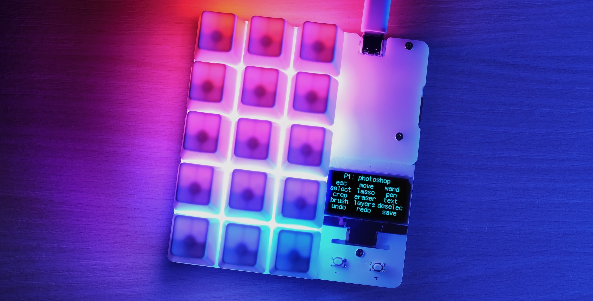

# Writing duckyScript

[Get duckyPad](https://www.tindie.com/products/21984/) | [Official Discord](https://discord.gg/4sJCBx5) | [Getting Started](getting_started.md) | [Table of Contents](#table-of-contents)

------

## Overview

duckyScript is a simple scripting language for automating keyboard inputs.

It was originally developed for [USB Rubber Ducky](https://shop.hak5.org/products/usb-rubber-ducky-deluxe).

However, [duckyPad uses it too](https://www.tindie.com/products/dekunukem/duckypad-do-it-all-mechanical-macropad/) to provide powerful macro scripting.



**duckyScript 3** with much improved capability is [now available](duckyscript3_instructions.md)!

## Examples

duckyScript is very straightforward to write, you basically just tell it what key to press!

Some quick examples:

### Open Task Manager

```
CONTROL SHIFT ESC
```

### Open a webpage on windows

```
WINDOWS r
DELAY 500
STRING https://www.youtube.com/watch?v=dQw4w9WgXcQ
ENTER
```

### Save a webpage then close it

```
CONTROL s
DELAY 750
ENTER
DELAY 750
CONTROL w
```

## List of Commands

- [REM and //](#rem-and-)

- [DEFAULTDELAY](#defaultdelay)

- [DEFAULTCHARDELAY](#defaultchardelay)

- [CHARJITTER](#charjitter-x)

- [DELAY](#delay)

- [STRING and STRINGLN](#string-and-stringln)

- [STRINGLN_BLOCK and END_STRINGLN](#stringln_block-and-end_stringln)

- [REPEAT](#repeat)

- [Special Keys](#special-keys)

- [KEYDOWN / KEYUP](#keydown--keyup)

- [Mouse Buttons](#mouse-buttons)

- [MOUSE_MOVE](#mouse_move-x-y)

- [MOUSE_WHEEL](#mouse_wheel-x)

- [SWC_SET](#swc_set-n-r-g-b)

- [SWC_FILL](#swc_fill-r-g-b)

- [SWC_RESET](#swc_reset-n)

- [DP_SLEEP](#dp_sleep)

- [PREV_PROFILE / NEXT_PROFILE](#prev_profile--next_profile)

- [GOTO_PROFILE](#goto_profile)

- [GOTO_PROFILE_NAME](#goto_profile_name)

- [EMUK](#emuk)

- [LOOP](#loop)

- [duckyScript 3 Advanced Features](#duckyscript-3-advanced-features)

### `REM` and `//`

Comments. Any line starting with those is ignored.

### `REM_BLOCK` and `END_REM`

Comment block. Everything in-between is ignored.

### `DEFAULTDELAY`

Specifies how long (in milliseconds) to wait between **`each line of command`**.

If unspecified, `DEFAULTDELAY` is 18ms.

```
DEFAULTDELAY 100
// duckyPad will wait 100ms between each subsequent command
```

### `DEFAULTCHARDELAY`

`DEFAULTCHARDELAY` specifies how long (in milliseconds) to wait between each **`key stroke`**.

If unspecified, `DEFAULTCHARDELAY` is 18ms.

```
DEFAULTCHARDELAY 50
// duckyPad will wait 50ms between each key stroke
```

### `CHARJITTER X`

Adds an **additional** random delay between 0 and X milliseconds after `each key stroke`.

Can be used to make typing more human-like.

Set to 0 to disable.

### `DELAY`

`DELAY` creates a pause in script execution. Useful for waiting for UI to catch up.

```
DELAY 1000
// waits 1000 milliseconds, or 1 second
```

### `STRING` and `STRINGLN`

`STRING` types out whatever after it **`as-is`**.

```
STRING Hello world!
// types out "Hello world!"
```

`STRINGLN` also presses **enter key** at the end.

### `STRINGLN_BLOCK` and `END_STRINGLN`

Type out everything inside the block as-is.

Also presses **enter key** at the end of each line.

```
STRINGLN_BLOCK

According to all known laws of aviation,

there is no way a bee should be able to fly.

Its wings are too small to get its fat little body off the ground.

END_STRINGLN
```

### `STRING_BLOCK` and `END_STRING`

Similar to above, but without new line at the end.

### `REPEAT`

Repeats the last line **`n`** times.

```
STRING Hello world
REPEAT 10
// types out "Hello world" 11 times (1 original + 10 repeats)
```

For more advanced usage, use functions and `WHILE` loops in [duckyScript 3](duckyscript3_instructions.md).

### Special Keys

duckyScript also supports many special keys:

```
CTRL / RCTRL
SHIFT / RSHIFT
ALT / RALT
WINDOWS / RWINDOWS
COMMAND / RCOMMAND (mac)
OPTION / ROPTION (mac)
ESC
ENTER
UP / DOWN / LEFT / RIGHT
SPACE
BACKSPACE
TAB
CAPSLOCK
PRINTSCREEN
SCROLLLOCK
PAUSE
BREAK
INSERT
HOME
PAGEUP / PAGEDOWN
DELETE
END
MENU
POWER

F1 to F24

(media keys)
MK_VOLUP
MK_VOLDOWN
MK_MUTE
MK_PREV
MK_NEXT
MK_PP (play/pause)
MK_STOP

(numpad keys)
NUMLOCK
KP_SLASH
KP_ASTERISK
KP_MINUS
KP_PLUS
KP_ENTER
KP_0 to KP_9
KP_DOT
KP_EQUAL

(Japanese input method keys)
ZENKAKUHANKAKU
HENKAN
MUHENKAN
KATAKANAHIRAGANA
```

Those special keys can be used on their own:

`WINDOWS`

...or can be combined with a character to form shortcuts:

`WINDOWS s`

...or can be combined with other special keys:

`WINDOWS SHIFT s`

------

* Type the key names as-is in **`ALL CAPS`**.

* **`UP TO 6 KEYS`** can be pressed simultaneously.

### `KEYDOWN` / `KEYUP`

Holds / Releases a key.

Can be used to input [Alt Codes](https://en.wikipedia.org/wiki/Alt_code) for special characters:

```
KEYDOWN ALT
KP_1
KP_7
KP_2
KEYUP ALT

// types out ¼
```

### Mouse Buttons

* `LMOUSE`: Click LEFT mouse button

* `RMOUSE`: Click RIGHT mouse button

* `MMOUSE`: Click MIDDLE mouse button

### `MOUSE_MOVE X Y`

Move mouse cursor `X` pixels horizontally, and `Y` pixels vertically.

* For `X`, a positive number moves RIGHT, negative number moves LEFT.

* For `Y`, a positive number moves UP, negative number moves DOWN.

* Set `X` or `Y` to 0 if no movement needed.

* Use `REPEAT` command to move further.

### `MOUSE_WHEEL X`

Scroll mouse wheel `X` lines.

* `X` must be between `-127` and `127`

* A positive number scrolls UP, negative number scrolls DOWN.

### `SWC_SET n r g b`

Change LED color of a switch

Set `n` to 0 for current key.

Set `n` between 1 to 15 for a particular key.

`r, g, b` can be constants or variables between 0 and 255.

### `SWC_FILL r g b`

Change color of **ALL** LEDs.

`r, g, b` can be constants or variables between 0 and 255.

### `SWC_RESET n`

Resets the key to default background color.

Set `n` to 0 for current key.

Set `n` from 1 to 15 for a particular key.

Set `n` to 99 for all keys.

### `DP_SLEEP`

Make duckyPad go to sleep.

Backlight and screen are turned off.

Press any key to wake up.

### `PREV_PROFILE` / `NEXT_PROFILE`

Switch to the previous / next profile.

### `GOTO_PROFILE`

Jump to a particular profile.

```
GOTO_PROFILE 3
// jump to profile #3
```
### `GOTO_PROFILE_NAME`

Use this command to jump to a particular profile by name.

```
GOTO_PROFILE_NAME NumPad
// jump to profile with name "NumPad"
```
### `EMUK`

Emulates a regular key.

It holds a key when you press it, and release only when you release it. Makes it behave more like a traditional keyboard.

Possible uses include push-to-talk voice chat, or WASD gamepad.

You should only use `EMUK` command **on its own**, i.e. the script should only have a single line of `EMUK` command and **nothing else**.

### `LOOP`

Allows you to **assign different actions to the same key**.

You can use it to toggle / cycle through several actions like this:

```
LOOP0:
STRING first action
ENTER

LOOP1:
STRING second action
ENTER

LOOP2:
STRING third action
ENTER
```

* When you press a key, a counter increments, and the script at the corresponding loop is executed.

* Loop and color state should persist through profile switches and reboots

## duckyScript 3 Advanced Features

duckyScript 3 gives duckyPad a big boost in capability, including:

* Variables, `IF` statements, `WHILE` loops, functions, randomisation, and more!

* Print to OLED screen

* Read button status

[Click me to learn more about advanced features!](duckyscript3_instructions.md)

## Table of Contents

[Main page](README.md)

[Getting Started Guide](getting_started.md)

[Kit Assembly Guide](kit_assembly_guide.md)

[Using duckyScript](duckyscript_info.md) | [duckyScript 3 Info](duckyscript3_instructions.md)

[Common issues / Troubleshooting](troubleshooting.md)

[Firmware Updates and Version History](firmware_updates_and_version_history.md)

[Make Your Own Keymap](./keymap_instructions.md)

[Build a duckyPad Yourself](build_it_yourself.md)

[Kickstarter Backer Acknowledgments](kickstarter_backers.md)

## Questions or Comments?

Please feel free to [open an issue](https://github.com/dekuNukem/duckypad/issues), ask in the [official duckyPad discord](https://discord.gg/4sJCBx5), DM me on discord `dekuNukem#6998`, or email `dekuNukem`@`gmail`.`com` for inquires.
