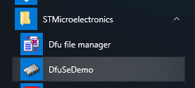
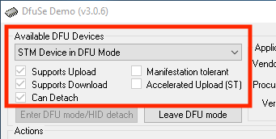
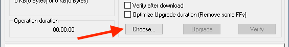
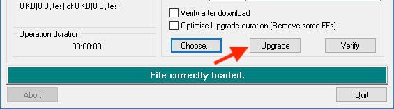
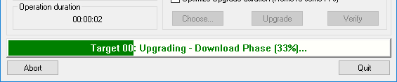

# duckyPad Firmware Updates and Version History

[Get duckyPad](https://www.tindie.com/products/21984/) | [Official Discord](https://discord.gg/4sJCBx5) | [Getting Started](getting_started.md) | [Table of Contents](#table-of-contents)

-----

## Latest Firmware

### 0.18.0

[Download Here](https://github.com/dekuNukem/duckyPad/raw/master/firmware/duckypad_v0.18.0.dfu)

🆕 **Mouse support!** [Click me for details.](https://github.com/dekuNukem/duckyPad/blob/master/duckyscript_info.md#mouse-buttons)

🆕 **Profile auto-switching** support! [Switch profiles automatically](https://github.com/dekuNukem/duckyPad-profile-autoswitcher) based on currently active window!

🆕 [Two-way HID communication](https://github.com/dekuNukem/duckyPad-profile-autoswitcher/blob/master/HID_details.md) support! Write your own software to control duckyPad!

⚠️ As this is a fairly large update, there might be some bugs lurking around. [Let me know](#questions-or-comments) if you run into one!

⚠️ Known issues:

* An user reported capitalized letters not working on Chromebook, let me know if that's the case on yours!

* Some AMD B550/X570 motherboard users reported disconnection issues. This is a chipset bug. [Apply the patch](https://www.pcmag.com/news/amd-locates-root-cause-of-usb-issues-on-b550-x570-motherboards) or use it through an USB hub should fix it.

## USB Firmware Updates

You can update duckyPad's firmware via USB, for bug fixes and and/or new features. 

### Enter DFU Mode

Locate the **`DFU`** button on the board:

* Make sure the board is unplugged.

* **`Hold down DFU button`** while plugging it into a computer.

* Once plugged in, you can release the button.

If all went well, `the backlight and display should stay off`.

### Windows

Download and install the [STM32 DfuSe tool](resources/en.stsw-stm32080_stm32_DfuSe.zip) from this repo. (You can also download it from [the official website](https://www.st.com/en/development-tools/stsw-stm32080.html), but it requires creating an account.)

Launch the `DfuSeDemo` software:

In the `Available DUF Devices` section at top left corner, you should see a `STM Device in DFU Mode`.

* If nothing shows up, you might need to install a driver. [Click me for details](https://github.com/dekuNukem/daytripper/blob/master/dfu_driver_install.md)

Press the `Choose...` button and select a firmware file in `.dfu` format.

* [Click me](https://github.com/dekuNukem/duckyPad/raw/master/firmware/duckypad_v0.17.0.dfu) to download the latest firmware (v0.17.0)

* ...or [scroll down](#firmware-version-history) for older firmware versions.

Press `Upgrade` button to start uploading the new firmware into the microcontroller.

And now the firmware is being updated!

**It should only take a few seconds!** **`Try using a USB hub`** if it is particularly slow.

After completion, press **`RESET`** button (or power-cycle) to start using the new firmware. 

### macOS / Linux

Using terminal, install [dfu-util](http://dfu-util.sourceforge.net/) with a package manager. For macOS you can use [Brew](https://brew.sh/):

`brew install dfu-util`

Hold DFU button and connect duckyPad, then run:

`dfu-util --device ,0483:df11 -a 0 -D /path/to/duckypad_firmware.dfu`

After completion, press **`RESET`** button (or power-cycle) to start using the new firmware. 

## Firmware Version History

### 0.18.0

[Download Here](https://github.com/dekuNukem/duckyPad/raw/master/firmware/duckypad_v0.18.0.dfu)

🆕 **Mouse support!** [Click me for details.](https://github.com/dekuNukem/duckyPad/blob/master/duckyscript_info.md#mouse-buttons)

🆕 **Profile auto-switching** support! [Switch profiles automatically](https://github.com/dekuNukem/duckyPad-profile-autoswitcher) based on currently active window!

🆕 [Two-way HID communication](https://github.com/dekuNukem/duckyPad-profile-autoswitcher/blob/master/HID_details.md) support! Write your own software to control duckyPad!

⚠️ As this is a fairly large update, there might be some bugs lurking around. [Let me know](#questions-or-comments) if you run into one!

⚠️ Known issues:

* An user reported capitalized letters not working on Chromebook, let me know if that's the case on yours!

* Some AMD B550/X570 motherboard users reported disconnection issues. This is a chipset bug. [Apply the patch](https://www.pcmag.com/news/amd-locates-root-cause-of-usb-issues-on-b550-x570-motherboards) or use it through an USB hub should fix it.

### 0.17.0

[Download Here](https://github.com/dekuNukem/duckyPad/raw/master/firmware/duckypad_v0.17.0.dfu)

* `LOOP` counter will no longer reset during sleep.

* Key colour changes will also now persist through sleep.

* `MENU` key now works properly.

### 0.16.0

[Download Here](https://github.com/dekuNukem/duckyPad/raw/master/firmware/duckypad_v0.16.0.dfu)

* Added `COMMAND` and `OPTION` aliases for macOS. 

* Added support for right-side modifier keys, such as `RCTRL`, `RSHFIT`, `RALT`, etc.

* [Click me](https://github.com/dekuNukem/duckyPad/blob/master/duckyscript_info.md#special-keys) to learn more.

### 0.15.0

[Download Here](https://github.com/dekuNukem/duckyPad/raw/master/firmware/duckypad_v0.15.0.dfu)

* Added `DP_SLEEP` command to make duckyPad to go sleep.

* Added `PREV_PROFILE`, `NEXT_PROFILE`, and `GOTO_PROFILE` commands for profile switching.

* Fixed a bug, `F13 - F24` keys should work properly now.

### 0.14.0

[Download Here](https://github.com/dekuNukem/duckyPad/raw/master/firmware/duckypad_v0.14.0.dfu)

* Added attributions and metadata in keymap files, updated firmware to handle them.

* Added support for cedilla deadkey in keymaps.

### 0.13.0

[Download Here](https://github.com/dekuNukem/duckyPad/raw/master/firmware/duckypad_v0.13.0.dfu)

* Added `SWCOLOR` command to change the colour of a key inside a script.

* Read about its usage [here](https://github.com/dekuNukem/duckyPad/blob/master/duckyscript_info.md#swcolor-experimental).

### 0.12.1

[Download Here](https://github.com/dekuNukem/duckyPad/raw/master/firmware/duckypad_v0.12.1.dfu)

* Fixed an issue of key sticking with `HOLD` command.

### 0.12.0

[Download Here](https://github.com/dekuNukem/duckyPad/raw/master/firmware/duckypad_v0.12.0.dfu)

* Added an **experimental** `LOOP` command, allowing cycling through different actions on the same key.

* Read about its usage [here](https://github.com/dekuNukem/duckyPad/blob/master/duckyscript_info.md#loop-experimental).

### 0.11.3

[Download Here](https://github.com/dekuNukem/duckyPad/raw/master/firmware/duckypad_v0.11.3.dfu)

* Fixed a bug that prevented `HOLD` command from working on the very first press.

### 0.11.2

[Download Here](https://github.com/dekuNukem/duckyPad/raw/master/firmware/duckypad_v0.11.2.dfu)

* Fixed a bug in keymap parser to allow `SHIFT` and `AltGr` to be pressed simultaneously.

### 0.11.1

[Download Here](https://github.com/dekuNukem/duckyPad/raw/master/firmware/duckypad_v0.11.1.dfu)

* Increased maximum simultaneous key presses to 6.

* Now you can type [alt codes](resources/altcodes.pdf) like `ALT KP_0 KP_1 KP_9 KP_7`.

* Using duckyPad as a WASD gamepad with [`HOLD` command](https://github.com/dekuNukem/duckyPad/blob/master/duckyscript_info.md#hold-experimental) becomes more viable too.

### 0.11.0

[Download Here](https://github.com/dekuNukem/duckyPad/raw/master/firmware/duckypad_v0.11.0.dfu)

🆕 Added keymap file support for multiple keyboard layouts.

* Instead of hard-coded keyboard layouts, you can now download up to 8 keymap files to the SD card and use them on duckyPad.

* See [the updated guide](https://github.com/dekuNukem/duckyPad/blob/master/getting_started.md#using-the-duckypad-configurator) about loading keymaps to your duckyPad.

* See [this guide](https://github.com/dekuNukem/duckyPad/blob/master/keymap_instructions.md) about making your own keymaps.

🆕 Added extended ASCII character support.

* Now `STRING` command can type out characters like `§²µ¤³°ß` if they exist on the current keyboard layout.

🆕 Added support for dead keys.

* `STRING` command can now also use dead keys to type out characters with accents such as `òóôõö`.

🆕 Added German keyboard layout.

🆕 Added `F13` to `F24` keys.

🆕 Added `POWER` key.

### 0.10.0

[Download Here](https://github.com/dekuNukem/duckyPad/raw/master/firmware/duckypad_v0.10.0.dfu)

* Improved `HOLD` command performance

### 0.9.0

[Download Here](https://github.com/dekuNukem/duckyPad/raw/master/firmware/duckypad_v0.9.0.dfu)

* Added profile quickswitching

* **`Hold down`** `+` button and jump between profiles

### 0.8.0

[Download Here](https://github.com/dekuNukem/duckyPad/raw/master/firmware/duckypad_v0.8.0.dfu)

* Added `HOLD` command, where duckyPad will hold a key when you press it, and release only when you release it.

* See [this guide](https://github.com/dekuNukem/duckyPad/blob/master/duckyscript_info.md) for details. 

* This command makes it behave more like a traditional keyboard.

* You can use this command to turn duckyPad into a WASD game pad for example.

* Adjusted configuration file structure. You might need to set your keyboard layout again.

### 0.7.0

[Download Here](https://github.com/dekuNukem/duckyPad/raw/master/firmware/duckypad_v0.7.0.dfu)

* Added support for numpad keys. See [this guide](https://github.com/dekuNukem/duckyPad/blob/master/duckyscript_info.md) for details. 

### 0.6.0

[Download Here](https://github.com/dekuNukem/duckyPad/raw/master/firmware/duckypad_v0.6.0.dfu)

* Added support for `AZERTY (French)`, `AZERTY (Belgium)`, and `Dvorak` layout.

* **`HOLD DOWN TOP LEFT KEY`** while **`PLUGGING IT IN`** to switch layouts.

* Some behind-the-scene optimisation

### 0.5.0

[Download Here](https://github.com/dekuNukem/duckyPad/raw/master/firmware/duckypad_v0.5.0.dfu)

* Added RGB LED brightness adjustment

* Hold down +/- button to change brightness

### 0.4.0

[Download Here](https://github.com/dekuNukem/duckyPad/raw/master/firmware/duckypad_v0.4.0.dfu)

* Added support media keys (volume up/down, play/pause, mute, prev/next track, etc)

* [More details](duckyscript_info.md).

### 0.3.0

[Download Here](https://github.com/dekuNukem/duckyPad/raw/master/firmware/duckypad_v0.3.0.dfu)

* Added support for `MENU` key (the 'right click' key on windows keyboard that no one uses).

* Increased max number of profiles to 32.

### 0.2.1

[Download Here](https://github.com/dekuNukem/duckyPad/raw/master/firmware/duckypad_v0.2.1.dfu)

* duckyPad now store its firmware version on SD card, so PC app can check for updates.

### 0.2.0

[Download Here](https://github.com/dekuNukem/duckyPad/raw/master/firmware/duckypad_v0.2.0.dfu)

Major update. New features and optimisations.

* You can now use symbols like `?*<>/\` in key names.

* Significantly increased profile switching speed.

* Added sleep mode. Your duckyPad can now turn off after a configurable delay. Press any key to wake it up.

* Other minor fixes

### 0.1.0

[Download Here](https://github.com/dekuNukem/duckyPad/raw/master/firmware/duckypad_v0.1.0.dfu)

Initial Release

## Table of Contents

[Main page](README.md)

[Getting Started Guide](getting_started.md)

[Kit Assembly Guide](kit_assembly_guide.md)

[Using duckyScript](duckyscript_info.md)

[Common issues / Troubleshooting](troubleshooting.md)

[Firmware Updates and Version History](firmware_updates_and_version_history.md)

[Make Your Own Keymap](./keymap_instructions.md)

[Manual Setup](./manual_setup.md)

[Build a duckyPad Yourself](build_it_yourself.md)

[Kickstarter Backer Acknowledgments](kickstarter_backers.md)

## Questions or Comments?

Please feel free to [open an issue](https://github.com/dekuNukem/duckypad/issues), ask in the [official duckyPad discord](https://discord.gg/4sJCBx5), DM me on discord `dekuNukem#6998`, or email `dekuNukem`@`gmail`.`com` for inquires.
