# Getting Started with duckyPad

[Official Discord](https://discord.gg/4sJCBx5) | [Pre-order on Tindie!](https://www.tindie.com/products/21984/) | [Getting Started](getting_started.md) | [Table of Contents](#table-of-contents)

------

Congratulations on your new toy! Here is a short guide on how to use your duckyPad.

## Kit Assembly

If your duckyPad has not been assembled yet, [see this guide](/kit_assembly_guide.md) to put it together.

## Quick Start

Your duckyPad should come with a SD card already installed, containing some demo profiles.

Simply plug it into your computer, and voilà:

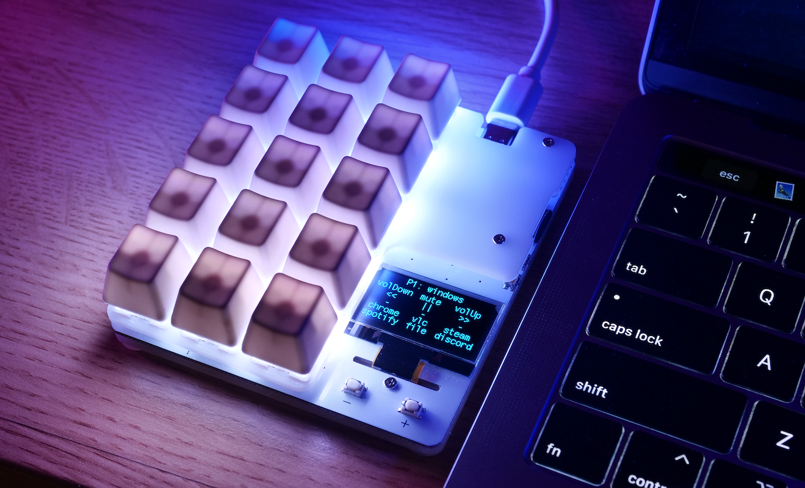

* Press a key to execute the corresponding script.

* Press `+` and `-` button to switch profiles.

* **`Hold down`** `+` button for profile quickswitch.

* **`Hold down`** `-` button to change RGB backlight brightness.

* To change keyboard layout, **`HOLD DOWN TOP LEFT KEY`** while **`PLUGGING IT IN`**, then select your layout.

## Writing Your Own Scripts

The samples might be fun, but duckyPad's true purpose is to do what YOU want! So here's how.

### SD Card

* duckyPad uses a microSD card to store profiles, scripts, and settings.

* To remove the SD card, push inwards to unlock.

* To install the SD card, insert logo side up, push until it clicks in place.

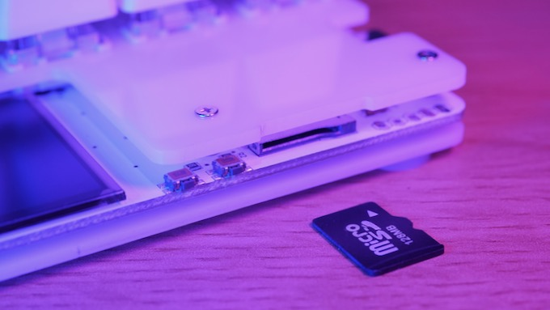

* You *can* insert/remove the SD card while duckyPad is on.

* But doing so might corrupt SD card content, so make backups.

* If you decide to use your own SD card, it should be formatted in [FAT32 or FAT](resources/pics/format.PNG).

### Download the duckyPad Configurator

[Head here to download the latest release](https://github.com/dekuNukem/duckyPad/releases) for Windows, macOS, and Linux.

Extract the `.zip` file and launch the application by clicking `duckypad_config.exe`:

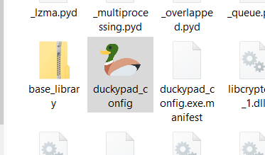

For Linux users, simply run the `duckypad_config.py` script with Python3.6 or higher. 

### "Untrusted App" Warnings

When trying to run the app, your system might complain about this software being untrusted. This is because I haven't had the code digitally signed, which costs hundreds of dollars a year.

Please feel free to [review the code](https://github.com/dekuNukem/duckyPad/tree/master/pc_software). If you really don't trust the app, you can run the `duckypad_config.py` script itself with Python3. Finally, you can [configure your duckyPad completely manually](#Configure-duckyPad-Manually).

For Windows 10, click `More info` and then `Run anyway`.

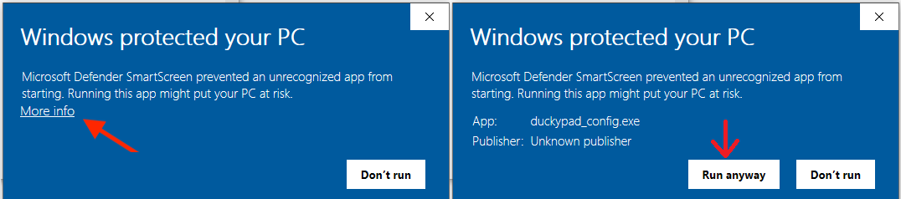

For macOS, **`RIGHT CLICK`** on the app and select `Open`. You might have to do it twice.

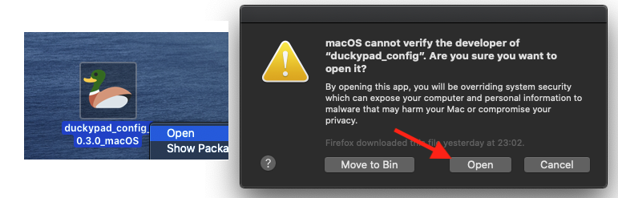

### Using the duckyPad configurator

Remove the SD card from duckyPad, mount it on your computer and launch the app. It should look like this:

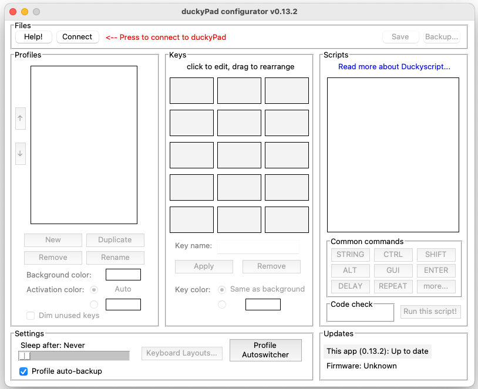

Press the `Open...` button, and select the **`entire SD card`**:

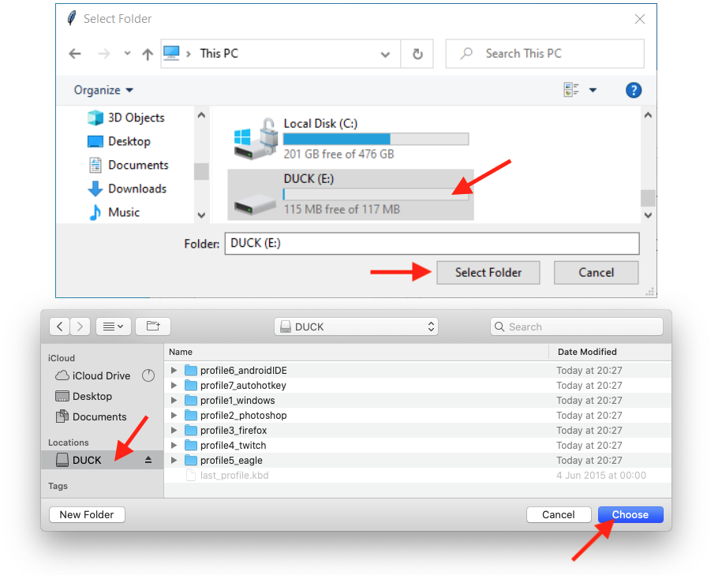

The application should load up the data from the SD card:

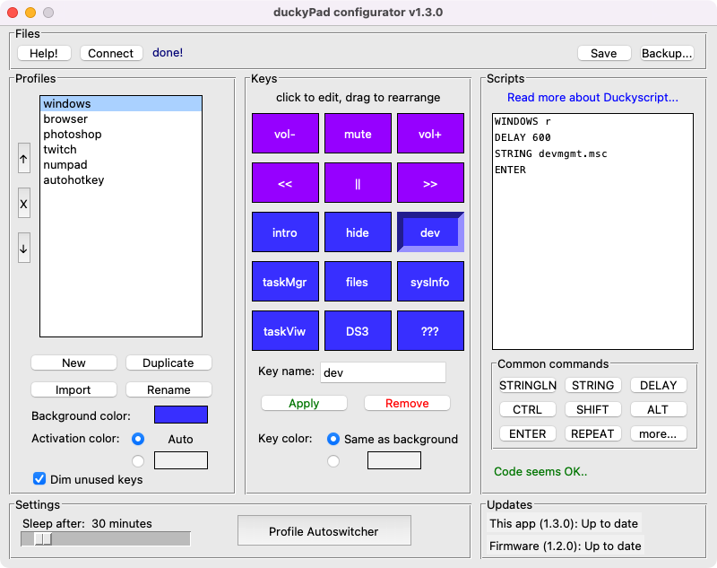

It might look a bit overwhelming, but don't worry, let's break it down.

### Profiles

* The leftmost column is for *profiles*.

* Each profile contains a group of scripts corresponding to the keys on the duckyPad.

* As you can see, you typically create a profile for each app you want to control.

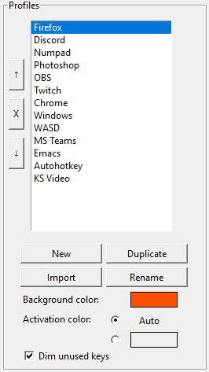

* Use the buttons to create a new profile, duplicate an existing profile, and remove/rename a profile.

* Use the up/down arrow button to reorder profiles.

* Choose a background color for the RGB backlight.

* `Activation color` is the color that a key changes into when you press it. On `Auto` it would be the inverse of background color.

* By default unused keys are dimmed, you can override this by unticking the checkbox.

### Keys

The middle column is for *keys*:

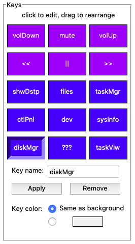

* Here you can configure the 15 keys on your duckyPad.

* Click a key to select it.

* Type to give it a name, or click `Remove` to delete it.

* You can assign an unique color to each key, or use the same color as background.

* Drag a key to rearrange its order.

### Scripts

Finally, the rightmost column is for *scripts*:

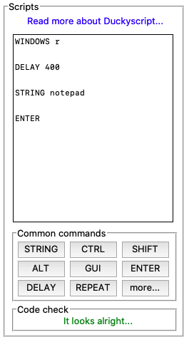

* When you select a key, the script it will execute is displayed here.

* duckyPad uses duckyScript, please [read about its usage here](duckyscript_info.md).

* Code check will be performed as you type, errors will be highlighted in yellow.

* Press `Run this script!` to test-run it on your computer. **`MAKE SURE YOU TRUST THE SCRIPT!`**

* Test-run starts after a 2-second delay.

* Test-run can't get past [Windows User Account Control](resources/pics/app/uac.png) screens. You'll have to run it on real thing.

* On macOS, if test-run doesn't work, [go to System Preferences -> Security & Privacy -> Accessibility](resources/pics/app/macos.png), unlock, remove then add the app.

* Test-run might not be 100% accurate, some keys like `Capslock` and `Numlock` can't be emulated in software. Run your scripts on the real thing if you're not sure.

### Settings & Updates

One the bottom we have settings and updates section.

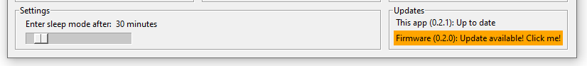

By default, duckyPad goes to sleep after 30 minutes. Adjust the slider to set your own delay. Drag it all the way left for always-on.

`Updates` section shows available updates for this app and duckyPad firmware. **Click on the text** for instructions.

### Keyboard Layouts

duckyPad also supports multiple keyboard layouts.

Press `Keyboard Layouts...` button to open its setting:

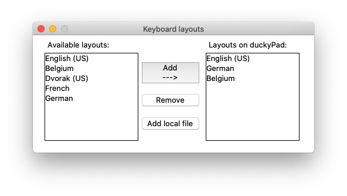

* The app will pull [available keymaps](sample_profiles/keymaps) from this repo and display them in the left column.

* Select one and press `Add` to add it to your duckyPad.

* Up to 8 keymaps can be loaded at one time.

* To make your own keymap, see [this guide](./keymap_instructions.md).

### Don't forget to save!

* Press the `Save` button to save the changes to SD card. It might take a few seconds.

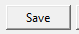

### Making backups

* No storage media is 100% reliable, so it is very important to **`make backups`**!

* To do so, press `Save as...` and select an empty folder.

* Or just manually copy everything on the SD card to somewhere else.

* To restore a backup, [format the SD card in FAT or FAT32](resources/pics/format.PNG), then copy everything back.

### Run it!

Eject the SD card from your computer, insert it into duckyPad, plug it in. It should start up and display the profile names and key names, as well as the customised colours.

* Press a key to execute the corresponding script.

* Press `+` and `-` button to switch profiles.

* **`Hold down`** `+` button for profile quickswitch.

* **`Hold down`** `-` button to change RGB backlight brightness.

* To change keyboard layout, **`HOLD DOWN TOP LEFT KEY`** while **`PLUGGING IT IN`**, then select your layout.

## Tips and Tricks

### Consolidate Keyboard Shortcuts

The most obvious use case is putting your commonly used hotkeys on duckyPad! Simply create a profile and add them in.

For many applications, you can find an official list of keyboard shortcuts. Just search `app_name shortcuts` on Google.

Some examples:

[Firefox](https://support.mozilla.org/en-US/kb/keyboard-shortcuts-perform-firefox-tasks-quickly) and [Chrome](https://support.google.com/chrome/answer/157179?co=GENIE.Platform%3DDesktop)

[Windows](https://support.microsoft.com/en-gb/help/12445/windows-keyboard-shortcuts) and [macOS](https://support.apple.com/en-gb/HT201236)

[Word](https://support.microsoft.com/en-us/office/keyboard-shortcuts-in-word-95ef89dd-7142-4b50-afb2-f762f663ceb2), [Excel](https://support.microsoft.com/en-us/office/keyboard-shortcuts-in-excel-1798d9d5-842a-42b8-9c99-9b7213f0040f), [PowerPoint](https://support.microsoft.com/en-us/office/use-keyboard-shortcuts-to-create-powerpoint-presentations-ebb3d20e-dcd4-444f-a38e-bb5c5ed180f4), and other [Office apps](https://support.microsoft.com/en-us/office/keyboard-shortcuts-in-office-e765366f-24fc-4054-870d-39b214f223fd).

[Photoshop](https://helpx.adobe.com/uk/photoshop/using/default-keyboard-shortcuts.html), [Final Cut Pro](https://support.apple.com/en-gb/guide/final-cut-pro/ver90ba5929/mac), and [Premiere Pro](https://helpx.adobe.com/uk/premiere-pro/using/keyboard-shortcuts.html).

### Launching Apps on Windows - Using Task Bar

Another popular usage is launching apps. There are two ways of doing this. Here is the frist:

Find the app, `Right click -> More -> Pin to taskbar`:

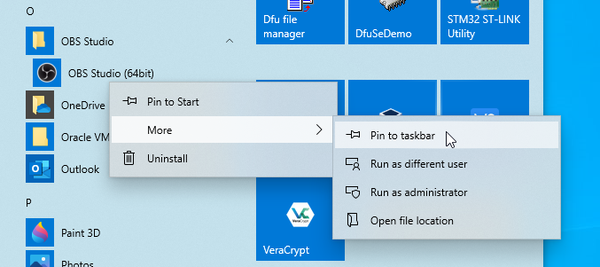

Now you can use `WIN + number` to launch the apps on the task bar:

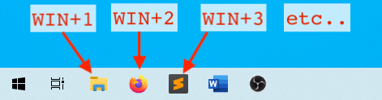

In duckyScript, it would be `WINDOWS 1`, `WINDOWS 2`, etc...

### Launching Apps on Windows - Using Shortcuts

This method works with **`ANY FILE`**, not just apps!

`Right click` on any file, select `Send to... -> Desktop (create shortcut)`.

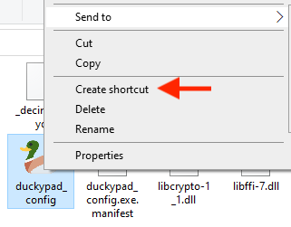

Find the new shortcut on your desktop, right click and select `Properties`

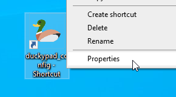

Set a hotkey in the `Shortcut Key` box:

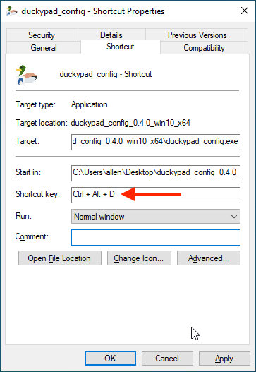

Then you can use duckyPad to press this combo to launch anything with a push of a button!

In this case, the duckyScript would be `CONTROL ALT D`.

### Launching Apps on macOS

Go to `System Preferences` -> `Keyboard` -> `Shortcuts` -> `App Shortcuts`:

Press the `+` button, select an app to open, assign a hotkey, and set up duckyPad accordingly:

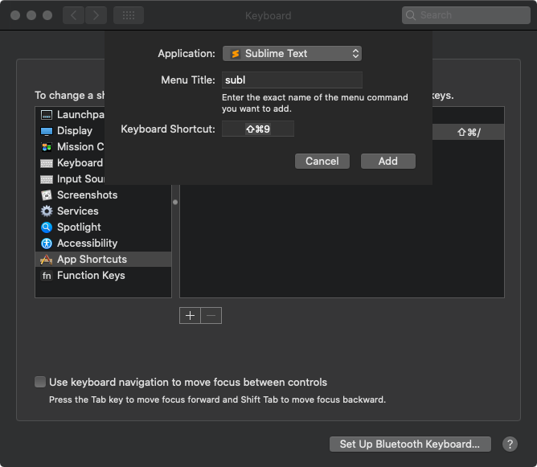

### Advanced Scripting with Autohotkey

You can use the free and open-source [autohotkey](https://www.autohotkey.com) for even more sophisticated needs, such as controlling mouse moments, executing scripts, etc.

To do this, duckyPad can be set up to press a simple combo like `WIN + F1`, which then get captured by autohotkey to execute a more complex custom script on your PC.

* Download and install [autohotkey](https://www.autohotkey.com)

* Download and save [this sample autohotkey script](https://raw.githubusercontent.com/dekuNukem/duckyPad/master/resources/duckypad_autohotkey_script.ahk) as an `.ahk` file.

* Switch the profile on duckyPad to [`autohotkey`](sample_profiles/profile7_autohotkey), and run the script by right clicking and select `Run Script`.

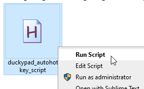

* AHK will execute the script. Press any key on duckyPad, a corresponding message box will appear.

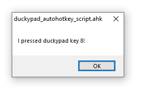

* Now you can write your own autohotkey script to do whatever you want!

Check out the [official tutorials](https://www.autohotkey.com/docs_1.0/Tutorial.htm), the [autohotkey profile](sample_profiles/profile7_autohotkey), and the [sample autohotkey script](resources/duckypad_autohotkey_script.ahk) upon which you can tinker with.

For macOS, you can try [bettertouchtool](https://folivora.ai).

## Getting Sluggish?

If you find duckyPad is getting slower at starting up and switching profiles, it's usually because of the SD card fragmentation.

* Make a backup of the files on SD card.

* Format it in [FAT32 or FAT](resources/pics/format.PNG).

* Copy the files back, it should be much faster now.

You can also use your own faster SD card.

## USB Firmware Updates

You can update duckyPad's firmware via USB, for bug fixes and and/or new features. 

[Please see this guide](./firmware_updates_and_version_history.md).

## Configure duckyPad Manually

If you don't trust or unable to run the software, you can also configure duckyPad manually.

[Please see this guide](./manual_setup.md).

## Table of Contents

[Main page](README.md)

[Getting Started Guide](getting_started.md)

[Kit Assembly Guide](kit_assembly_guide.md)

[Using duckyScript](duckyscript_info.md)

[Firmware Updates and Version History](firmware_updates_and_version_history.md)

[Make Your Own Keymap](./keymap_instructions.md)

[Manual Setup](./manual_setup.md)

[Build a duckyPad Yourself](build_it_yourself.md)

## Questions or Comments?

Please feel free to [open an issue](https://github.com/dekuNukem/duckypad/issues), ask in the [official duckyPad discord](https://discord.gg/4sJCBx5), DM me on discord `dekuNukem#6998`, or email `dekuNukem`@`gmail`.`com` for inquires.