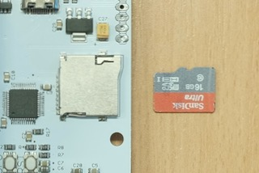
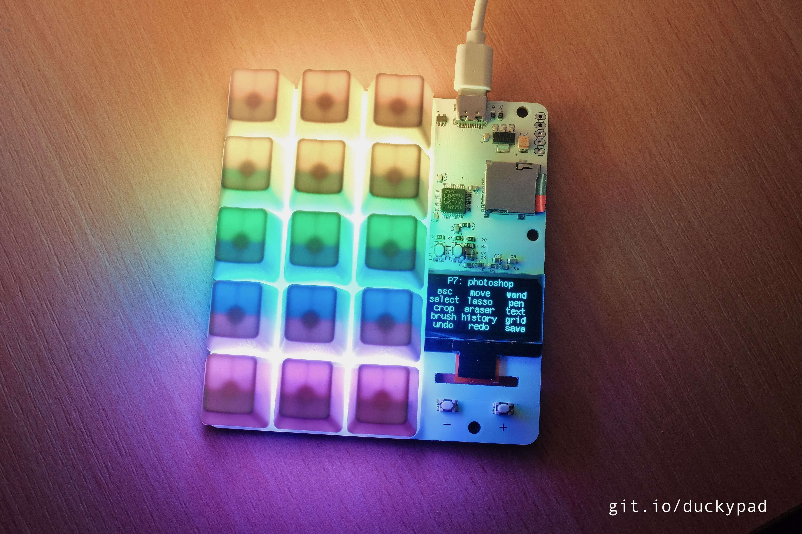
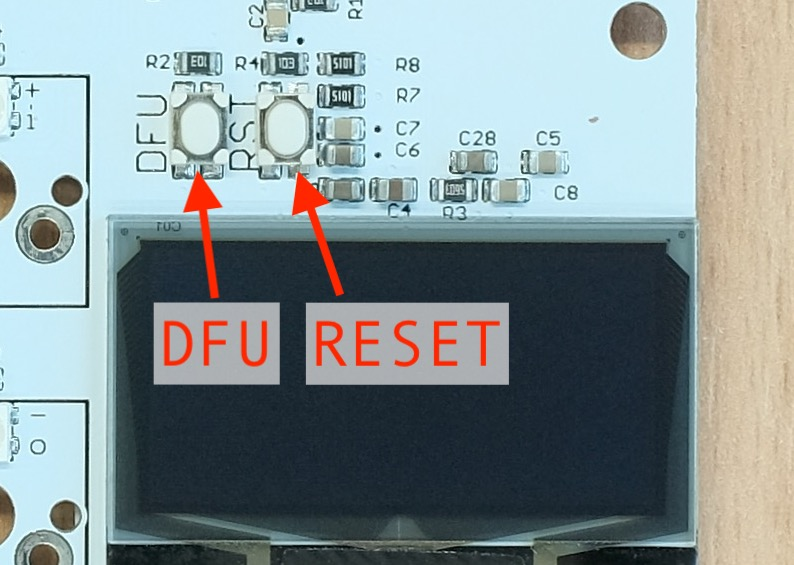

# Getting Started with duckyPad

Congratulations on your new toy! Here is a short guide on how to use your duckyPad.

## Quick Start

Your duckyPad should come with a SD card already installed, containing some demo profiles.

Simply plug it into your computer, and voilà:


* Use `+` and `-` button to switch profiles.

* Press a key to execute the corresponding script. Hold it down to repeat.

## Quick word on SD card

All duckyPad scripts are stored on a microSD card, which comes installed. But of course you can also use your own.

To use a new SD card, it needs to be formatted in FAT32, with `Default allocation size`:


To insert a SD card, Slide it into the slot logo side up, push inwards until it clicks in place:



To remove the SD card, push it inwards to unlock.

## Writing Your Own Scripts

Chances are you want to use your own scripts. So here's how! 

(remember you can always play with [existing examples on the SD card](https://github.com/dekuNukem/duckypad/raw/master/sample_SD_card.zip) as a starting point)

### Step 1: Preparing Profiles

A *Profile* contains a group of scripts corresponding to the keys on the duckyPad. Usually you would want to set up one profile per program you want to control. 

Profiles are created as folders at the **root level** of the SD card. They have naming conventions like `profile#_name`, where `#` is the profile number, and `name` being the name of the profile.

If you mount the SD card on your computer, you might see some examples like these:


Feel free to create more or delete the ones you don't need. Up to 16 profiles are supported.

### Step 2: Preparing Scripts

Now you're ready to write some scripts inside the profile folders. The script used in this project is Duckyscript, [click here to read its usage](https://github.com/hak5darren/USB-Rubber-Ducky/wiki/Duckyscript).

Each key has its own script file, named like `key#_name.txt`, where `#` is the key number(top left is 1, bottom right is 15), and `name` is a short description of what that key does. 

Here are some examples:


* It helps to take a look at those examples before writing your own

* The screen will only display the **first 7 characters** of the key name, so keep it short!

* You can leave gaps in the key numbering (such as only defining key 1, 2, 6, 12, 15, etc)

### Step 3: Optional Parameters

There are also some optional settings you can adjust. You don't have to do it, but it will look better if you do.

Simply create a file named `config.txt` in a profile folder like this:


#### Backlight Colors

To set your custom backlight color, put the following lines **`AT THE BEGINNING`** of `config.txt`:

```
BG_COLOR 255 100 0
KEYDOWN_COLOR 100 0 255
```

BG_COLOR is the background color. The number should be between 0 and 255, in the order of R-G-B.

* Can't decide? Use [this website](https://www.w3schools.com/colors/colors_picker.asp) to try some out. Use the `rgb()` value of each colour.

Similarly, KEYDOWN_COLOR is the color of the key when you press it down.

If you skip this step, the default backlight color would be light purple.

#### Dim Unused Keys

By default unused keys are dimmed. If you want everything to light up, add the following line in `config.txt`:

```
DIM_UNUSED_KEYS 0
```

#### Individual Key Colors

You can also assign colors to individual keys, this will override the background color above.

Just add lines for the keys you want in `config.txt` like this:

```
SWCOLOR_1 148 0 211
SWCOLOR_2 148 0 211
SWCOLOR_3 148 0 211
SWCOLOR_4 0 0 255
SWCOLOR_5 0 0 255
SWCOLOR_6 0 0 255
SWCOLOR_7 0 255 0
SWCOLOR_8 0 255 0
SWCOLOR_9 0 255 0
SWCOLOR_10 255 255 0
SWCOLOR_11 255 255 0
SWCOLOR_12 255 255 0
SWCOLOR_13 255 0  0
SWCOLOR_14 255 0  0
SWCOLOR_15 255 0  0
```

The above result in a pretty rainbow:



### Step 4: Run it!

Just like before, make sure the SD card is formatted in FAT32, copy all the profile folders in the root of the SD card, and insert it in your duckyPad.

duckypad should start up with the first profile, displaying the profile names and key names, as well as the background color.

Press the corresponding keys to execute their scripts, if there is an error it will show up on the screen.

Press +/- button to change profiles.

## Using Autohotkey

You can use [autohotkey](https://www.autohotkey.com) for even more extreme scripting needs, such as invoking complex scripts, or control mouse moments, etc.

Check out the [official tutorials](https://www.autohotkey.com/docs_1.0/Tutorial.htm), the [autohotkey profile](https://github.com/dekuNukem/duckypad/raw/master/sample_SD_card.zip), and a [sample autohotkey script](resources/duckypad_autohotkey_script.ahk) upon which you can tinker with. 

## USB Firmware Updates

You can update duckyPad's firmware via USB, for bug fixes and and/or new features. 

To do this, download and install the [STM32 DfuSe tool](resources/en.stsw-stm32080_stm32_DfuSe.zip) from this repo. You can download it from [the official website](https://www.st.com/en/development-tools/stsw-stm32080.html) too, but it requires creating an account.

First, locate the debug buttons on the board:



To update firmware:

* Make sure the board is OFF and unplugged.

* **Press and hold down the DFU button (one on the left)** while plugging it into a computer.

* Once it is plugged in, you can release the button.

If all went well, the backlight and display should stay off.

Now launch the `DfuSeDemo` software:


In the `Available DUF Devices` section at top left corner, you should see a `STM Device in DFU Mode`.


Press the `Choose...` button and select a firmware file in `.dfu` format. Make sure it's the correct file!

* [Click me](firmware/duckypad.dfu) for latest firmware


Press `Upgrade` button to start uploading the new firmware into the microcontroller.


And now the firmware is being updated!


It could take anywhere between a few seconds to a few minutes. Try using different USB ports if it is particularly slow. 

After uploading is complete, unplug and plug it back in to start using the new firmware. 

## Pretty Colors

Under construction...
