# Getting Started with duckyPad

[Get duckyPad](https://dekunukem.github.io/duckyPad-Pro/doc/landing.html) | [Official Discord](https://discord.gg/4sJCBx5) | [Getting Started](getting_started.md) | [Table of Contents](#table-of-contents)

------

Congratulations on your new toy! Here is a short guide on how to use your duckyPad.

## Join Our Discord!

Feel free to join our [Official Discord](https://discord.gg/4sJCBx5) for discussions, questions, sharing scripts, and latest updates!

## Kit Assembly

👇👇👇👇👇👇👇👇👇👇

[See this guide](./kit_assembly_guide.md) to put your duckyPad together!

☝️☝️☝️☝️☝️☝️☝️☝️☝️☝️

## Quick Start

Plug into your computer, and voilà:

* **`Hold down`** `+` button for settings

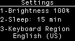

* Select the correct **keyboard region**

	* Adjust others to your liking

* To save & exit, **press any unlit key**.

* ⚠️ Start with the `Welcome` profile

	* Press a key to execute script

* Press `+` and `-` to switch profiles.

## Help! It's not working!

Are you using **`AMD motherboard?`** If so, read about the [USB chipset bug here!](https://www.tomshardware.com/uk/news/amd-suggest-possible-fixes-for-usb-connectivity-issues)

Try using a **USB hub**, update chipset drivers, or different ports.

For other issues, check out the [troubleshooting guide](troubleshooting.md).

## Writing Your Own Scripts

After playing with examples and see what duckyPad can do, time to write your own!

### Download Configurator

#### Windows

[Download the latest configurator here](https://github.com/duckyPad/duckyPad-Configurator/releases/latest)

Unzip and launch by clicking `duckypad_config.exe`:

Windows might complain about unsigned app.

Click `More info` and then `Run anyway`.

Feel free to [review the files](https://github.com/duckyPad/duckyPad-Configurator), or run the source code directly with Python.

#### MacOS & Linux

[See instruction here!](https://dekunukem.github.io/duckyPad-Pro/doc/linux_macos_notes.html)

### Using Configurator

Press the `Connect` button near top left.

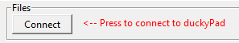

Everything should load up in a few seconds.

It may seem complex at first, let's break it down!

### Profiles

* The leftmost column is for *profiles*.

* You typically create one for **each app** you want to control.

Let's make a new profile!

Click `New` button, give it a name.

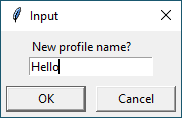

* Choose a background color for the RGB backlight.

* Use the `up/down/x` buttons to reorder/delete profiles.

* `Activation color` is the color that a key changes into when you press it.

### Keys

The middle columns are for *keys*:

* Select an empty key in the `Onboard Switches` section
* Type to give it a name
* Drag to rearrange

---------

* **`Custom Key Color`**: Set an unique color.
* **`Press Any Key to Abort`**: Allow exiting early in long macros.
	* Do not select if you're writing your own button-checking code
* **`Disable Auto-Repeat`**: Macro won't repeat when key is held down.
* Click **`Rotate`** for landscape mode.

### Scripts

Finally, the rightmost column is for *scripts*:

* This shows the **duckyScript** that the key will execute.

	* Can be anything from simple shortcuts to full-blown programs!

	* [**Read about detailed usage here**](https://dekunukem.github.io/duckyPad-Pro/doc/duckyscript_info.html).

	* For this example, put in `STRING Hello World!`

* Separate scripts possible for **On Press** and **On Release**

	* If not sure, just leave **On Release** blank.

* Code check will be performed as you type.

### Remember to Save!

* Press `Save` button to write the changes back to duckyPad.
* Check debug window for progress

### Try It Out!

duckyPad should reboot after saving.

Press `+/-` button to go to the new profile, and press the key.

It should execute the script and type out `Hello World!`:

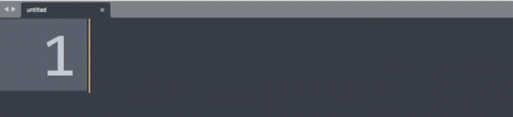

That's it! Now you know how to customise your duckyPad!

🎉 🎉 Great Job, but we're not done yet!

⚠️⚠️ **Please keep reading** for more useful information!

------------

### Profile Auto-Switching

duckyPad can **switch profiles automatically** based on **current active window**.

[Click me for details](https://github.com/dekuNukem/duckyPad-profile-autoswitcher)

### Careful with Passwords!

It might be tempting to have duckyPad type out passwords, but beware that all scripts are stored as **plain text** on SD card. Not a good idea!

### Automatic backups

* A local backup is created every time you save.
* Press `Backup...` button to access the backups.
* To restore, [format the SD card in FAT or FAT32](resources/pics/app/format.png), then copy everything back.

## Tips and Tricks

### Keyboard Shortcuts

The most obvious use case is putting your commonly used hotkeys on duckyPad!

For many applications, you can find an official list of shortcuts. Just search `app_name shortcuts` on Google. Examples:

[Firefox](https://support.mozilla.org/en-US/kb/keyboard-shortcuts-perform-firefox-tasks-quickly) and [Chrome](https://support.google.com/chrome/answer/157179?co=GENIE.Platform%3DDesktop)

[Windows](https://support.microsoft.com/en-gb/help/12445/windows-keyboard-shortcuts) and [macOS](https://support.apple.com/en-gb/HT201236)

[Word](https://support.microsoft.com/en-us/office/keyboard-shortcuts-in-word-95ef89dd-7142-4b50-afb2-f762f663ceb2), [Excel](https://support.microsoft.com/en-us/office/keyboard-shortcuts-in-excel-1798d9d5-842a-42b8-9c99-9b7213f0040f), [PowerPoint](https://support.microsoft.com/en-us/office/use-keyboard-shortcuts-to-create-powerpoint-presentations-ebb3d20e-dcd4-444f-a38e-bb5c5ed180f4), and other [Office apps](https://support.microsoft.com/en-us/office/keyboard-shortcuts-in-office-e765366f-24fc-4054-870d-39b214f223fd).

[Photoshop](https://helpx.adobe.com/uk/photoshop/using/default-keyboard-shortcuts.html), [Final Cut Pro](https://support.apple.com/en-gb/guide/final-cut-pro/ver90ba5929/mac), and [Premiere Pro](https://helpx.adobe.com/uk/premiere-pro/using/keyboard-shortcuts.html).

### Launching Apps on Windows - Task Bar

Another popular usage is launching apps. The easiest way is using Task Bar:

Find the app, `Right click -> More -> Pin to taskbar`:

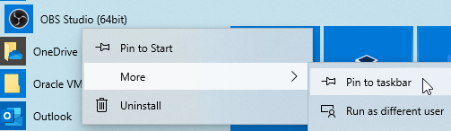

Now you can use `WIN + number` to launch them:

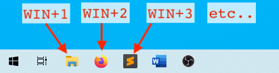

In duckyScript, it would be `WINDOWS 1`, `WINDOWS 2`, etc.

### Launching Apps on Windows - Shortcuts

This method works with **`ANY FILE`**, not just apps!

`Right click` on any file, select `Create shortcut`.

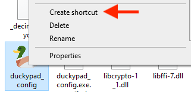

Find the new shortcut, right click and select `Properties`

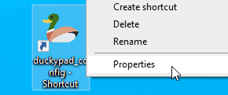

Set a hotkey in the `Shortcut Key` box:

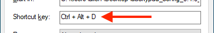

Then assign the combo on duckyPad!

In this case, the duckyScript would be `CONTROL ALT D`.

### Launching Apps on macOS

Go to `System Preferences` -> `Keyboard` -> `Shortcuts` -> `App Shortcuts`:

Press `+` button, select app, assign a hotkey, and set up duckyPad accordingly:

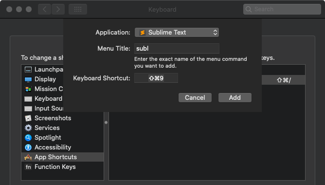

### Advanced Scripting with Autohotkey

You can use the free and open-source [Autohotkey](https://www.autohotkey.com) for even more advanced scripting needs.

duckyPad can press a simple combo like `WIN + F1`, which triggers autohotkey to execute a more complex script on your PC.

* Download and install [autohotkey](https://www.autohotkey.com)

* Download and save the [sample autohotkey script](./resources/duckypad_autohotkey_script.ahk) as an `.ahk` file.

* Activate the script by right clicking and select `Run Script`.

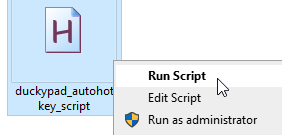

* Switch to `autohotkey` profile, press a key.

* Corresponding message box will appear.

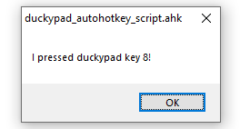

* Write your own AHK script!

Check out the [official tutorials](https://www.autohotkey.com/docs_1.0/Tutorial.htm), and how to [launch AHK on startup](https://www.autohotkey.com/docs/FAQ.htm#Startup).

For macOS, you can try [bettertouchtool](https://folivora.ai).

## I'm Having Issues!

Please take a look at the [Common issues / Troubleshooting](troubleshooting.md) guide.

If that doesn't help, feel free to contact me by [opening an issue](https://github.com/dekuNukem/duckypad/issues) or ask in the [official duckyPad discord](https://discord.gg/4sJCBx5).

## USB Firmware Updates

You can update duckyPad's firmware for new features and bug fixes. 

[Please see this guide](./firmware_updates_and_version_history.md).

## Table of Contents

[Main page](README.md)

[Getting Started Guide](getting_started.md)

[Kit Assembly Guide](kit_assembly_guide.md)

[Using duckyScript](duckyscript_info.md)

[Common issues / Troubleshooting](troubleshooting.md)

[Firmware Updates and Version History](firmware_updates_and_version_history.md)

[Make Your Own Keymap](./keymap_instructions.md)

[Build a duckyPad Yourself](build_it_yourself.md)

[Kickstarter Backer Acknowledgments](kickstarter_backers.md)

## Questions or Comments?

Please feel free to [open an issue](https://github.com/dekuNukem/duckypad/issues), ask in the [official duckyPad discord](https://discord.gg/4sJCBx5), DM me on discord `dekuNukem#6998`, or email `dekuNukem`@`gmail`.`com` for inquires.