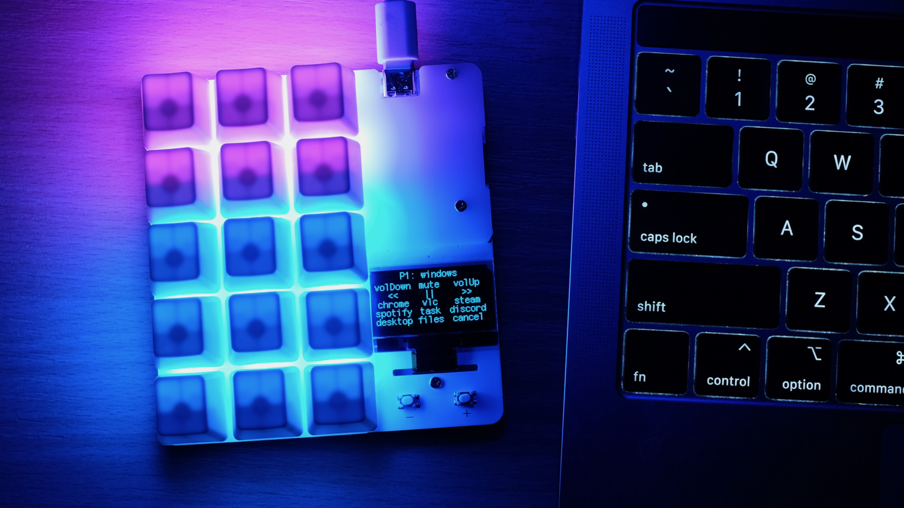
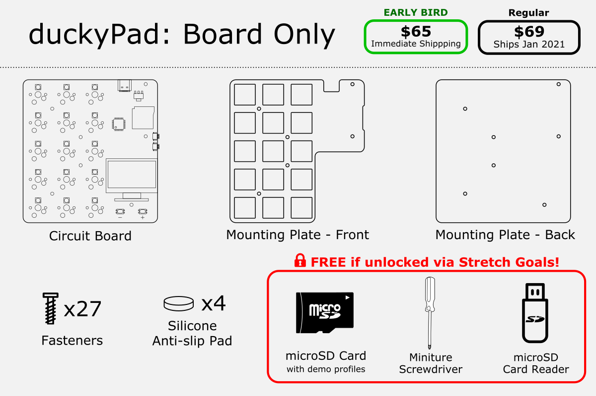
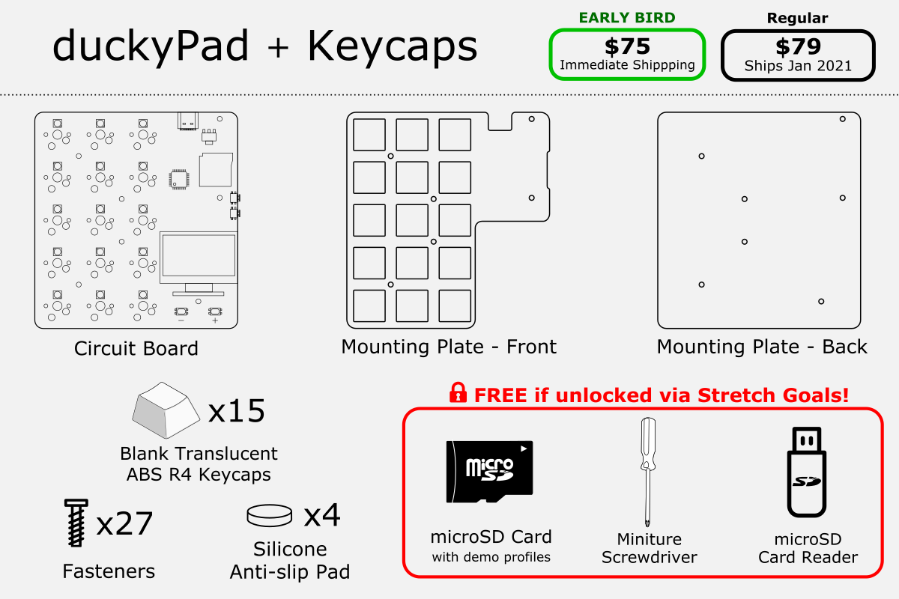
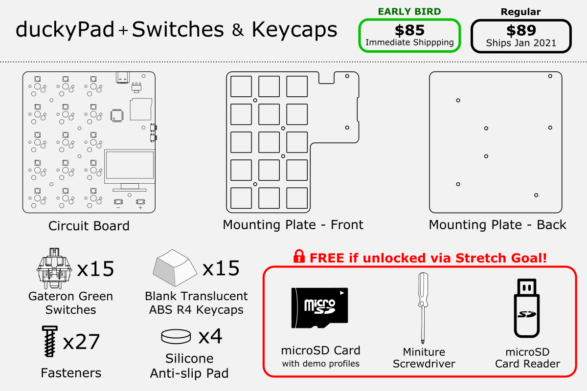

# duckyPad Kickstarter Information

[Official Discord](https://discord.gg/4sJCBx5) | [Pre-order on Tindie!](https://www.tindie.com/products/21984/) | [Getting Started](getting_started.md) | [Table of Contents](#table-of-contents)

----

Thank you very much for the interest and support of duckyPad!

The wait is almost over, and I'm glad to announce the details about the upcoming Kickstarter campaign!

If you haven't already done so, please consider [signing up the launch notification](https://www.kickstarter.com/projects/dekunukem/duckypad-do-it-all-mechanical-macropad) to get your hand on early-bird rewards!

## Launch Date, Duration, and Funding Goal

[duckyPad Kickstarter](https://www.kickstarter.com/projects/dekunukem/duckypad-do-it-all-mechanical-macropad) is planned to launch on **`Wednesday November 4th`** at:

* 11:00AM PST

* 12:00PM (noon) MST

* 1:00PM CST

* 2:00PM EST

* 7:00PM UTC/GMT

* 8:00PM CET

The campaign will run for **`26 days`**, and end on **`Monday November 30th`** at the **`same hour`**.

The **`funding goal`** is set to $10362 (£8000), which should be achievable without too much difficulties. 

## Rewards

### Overview

* There will be **`3 reward tiers`**.

* There are **`180 early bird`** slots with a **`discount`** AND **`immediate shipping`**! So get in early!

* duckyPads will be shipped in **`kit form`**. You can [put it together](kit_assembly_guide.md) in less than 10 minutes, **`no soldering needed`**.

### Tier 1: Board Only (add your own switches and caps!)

### Tier 2: Board + Keycaps (add your own switches!)

### Tier 3: The Whole Package

### Extras

* You can purchase a USB-C cable for $4 if you don't already have one.

* Extra goodies will be included with every order **`for free`** if **`stretch goals`** are met.

## Shipping

### Shipping Methods

duckyPads will be shipped from **`United Kingdom`**.

If you're already in UK, it will be posted via **[`Royal Mail 1st Class Signed For`](https://www.royalmail.com/sending/uk/signed-for-1st-class)**.

For everywhere else, the default shipping will be **[`Royal Mail International Standard`](https://www.royalmail.com/sending/international/international-standard)**:

* $6
* Untracked
* Typically 1 week for Europe
* Typically 2 weeks for everywhere else
* Proof of posting available

Optionally, you can upgrade to **[`Royal Mail International Tracked & Signed`](https://www.royalmail.com/sending/international/international-tracked-signed)**:

* $14
* End-to-end tracking
* Signature on delivery
* Typically 1 week for Europe
* Typically 2 weeks for everywhere else
* Proof of posting available

Finally, you can also upgrade to **[`DHL Express Worldwide`](https://www.dhl.co.uk/en/express.html)**:

* $45
* Within 3 working days
* End-to-end tracking 
* Signature on delivery

### When will my duckyPad ship?

For **`Early Bird`** backers:

* Shipping will begin after campaign concludes and fund is received. 

* Most likely will be **`early-to-mid December`**.

For regular backers:

* A new production run will take place to produce your boards.

* Most likely will ship **`Jan/Feb 2021`**.

I'm fairly confident with these estimates, however they are subject to change under unexpected circumstances.

### Will I get it by Christmas?

If you're one of the lucky **`early-bird`** backers, your duckyPad will ship after campaign concludes and fund is received.

So let's take a look at the timeline:

* Campaign ends on Nov 30th.

* Kickstarter takes [14 days to collect funds](https://help.kickstarter.com/hc/en-us/articles/360010120934-If-my-project-is-successfully-funded-how-do-I-receive-my-funds-) and transfer to me.

* Shipping will start when fund is received.

Therefore, early-bird shipping will most likely start on the **`week of December 14`**.

So with **`Royal Mail`** shipping, odds of it arriving before Christmas are:

* **`Very likely`** if you're in UK.

* **`Likely`** if you're in Europe.

* **`Possible but unlikely`** for everywhere else.

Of course, you can opt for faster **`DHL Worldwide Express`** shipping for better odds.

Anyway, I would recommend keeping your expectations in check, but hope for the best :)

## Stay in touch!

Questions, comments, feedbacks? Feel free to ask in the [Official Discord!](https://discord.gg/4sJCBx5)

And of course, there will be regular backer updates on Kickstarter once it's launched.

Media enquiries? Email `dekuNukem` `gmail`.`com`, or DM me on discord `dekuNukem#6998`.

## Table of Contents

[Main page](README.md)

[Getting Started Guide](getting_started.md)

[Kit Assembly Guide](kit_assembly_guide.md)

[Using duckyScript](duckyscript_info.md)

[Common issues / Troubleshooting](troubleshooting.md)

[Firmware Updates and Version History](firmware_updates_and_version_history.md)

[Make Your Own Keymap](./keymap_instructions.md)

[Manual Setup](./manual_setup.md)

[Build a duckyPad Yourself](build_it_yourself.md)

