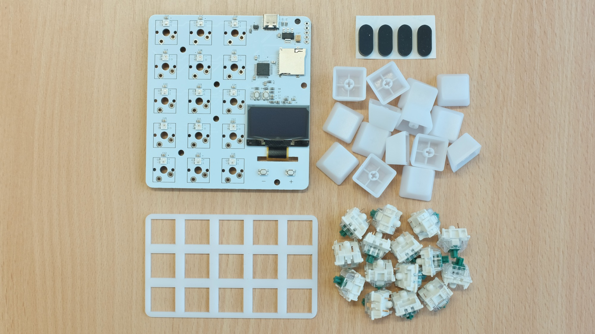
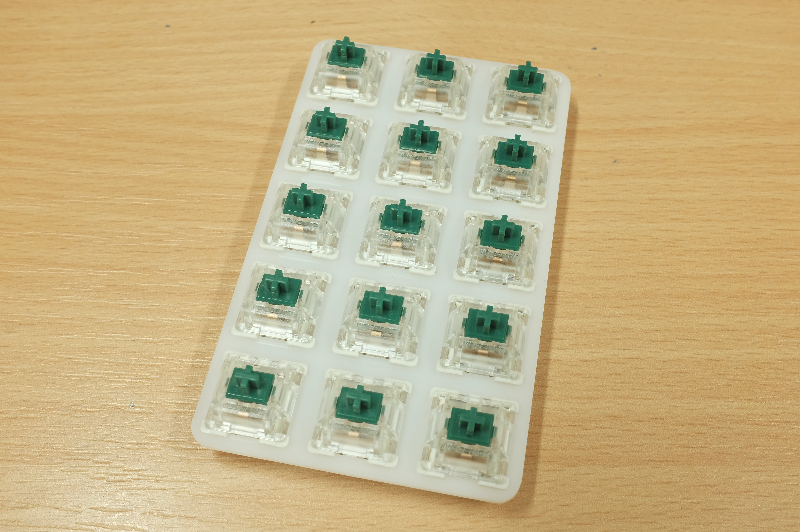
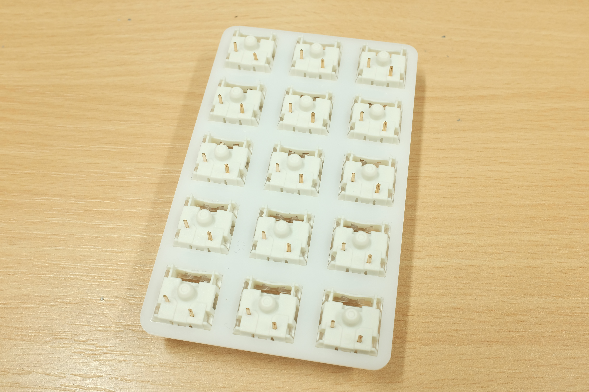
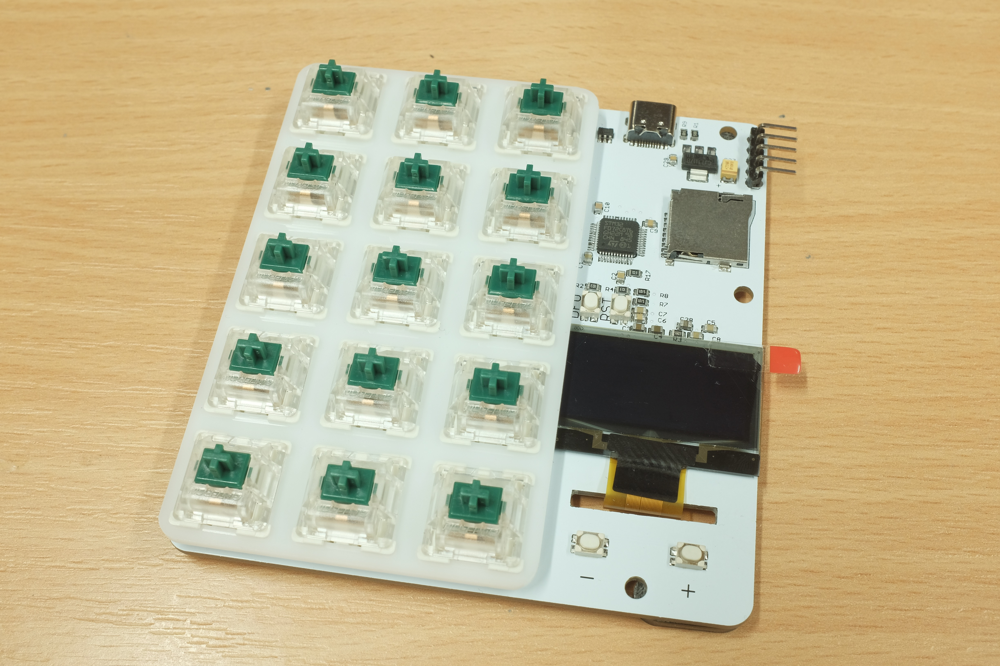
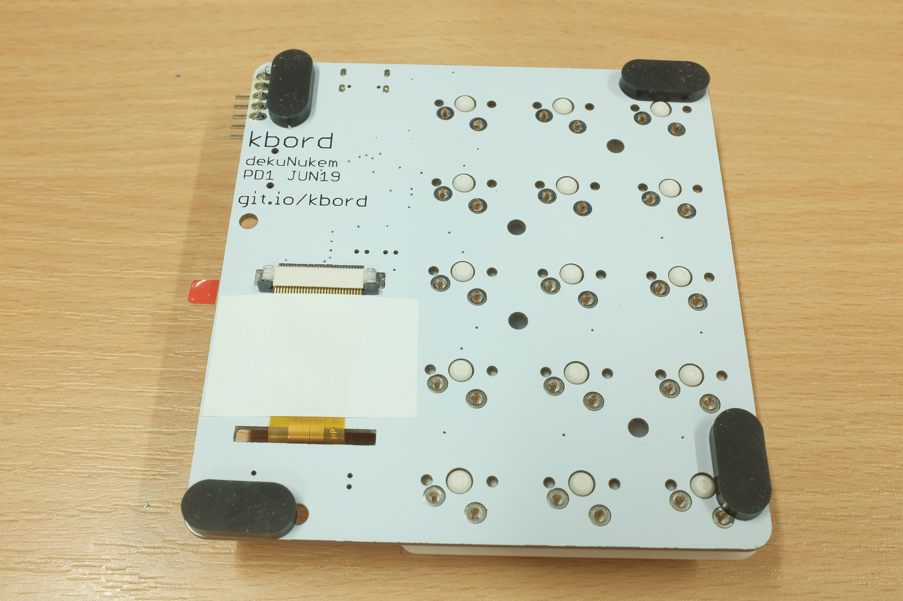
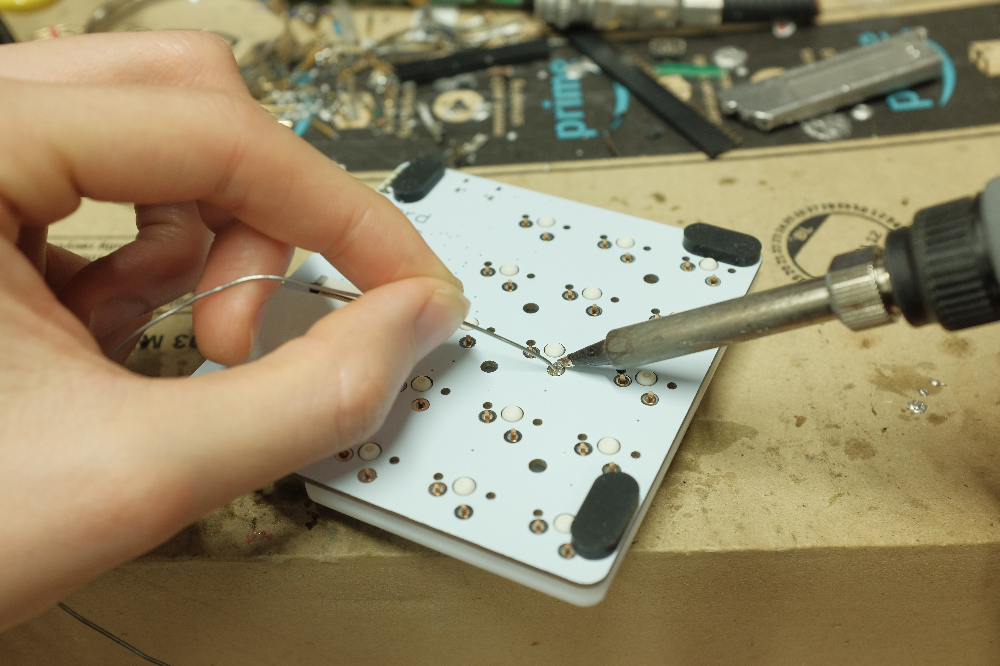
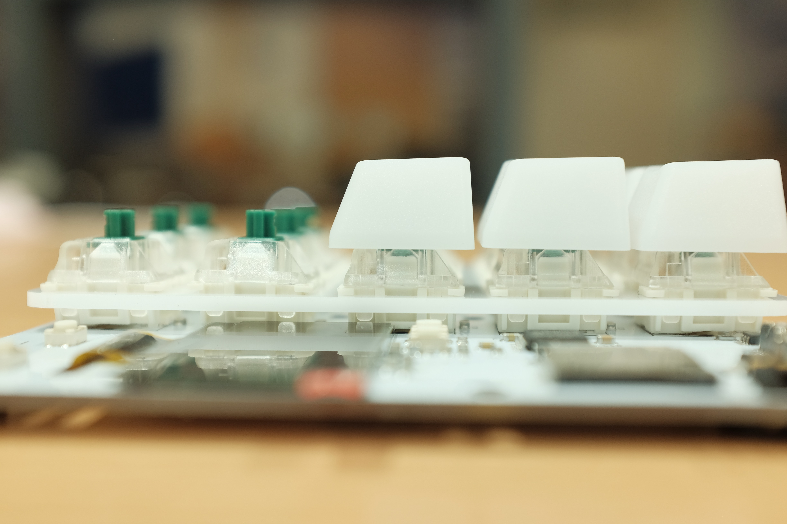

# duckyPad Kit Assembly Guide

[Main Page](/README.md) | [Buy duckyPad](/purchase_information.md)

------

Thanks for purchasing duckyPad! Here is a short guide on how to put everything together.

If yours is already assembled, please move on to the [Quick Start Guide](/getting_started.md).

## Assembly Steps

By now, you should have:

* 1x duckyPad circuit board

* 4x Rubber feet

* 1x Switch plate

* 15x Keycaps

* 15x Cherry MX-style switches

Start by peeling off the protective cover on the key plate:

Then insert the switches into the plate:

Make sure the pins are all in the same orientation, and not bent:

Insert the whole thing into the circuit board, matching up the holes:

Make sure all the pins has come through, and stick on the rubber feet:

Apply some pressure to make sure the switch assembly is flat against the circuit board, and solder the pins in place.

If you are unfamiliar with the process, there are a lot of resources on the internet, particularly youtube. Just search "how to solder keyboard switches". Here is [a sample tutorial video](https://www.youtube.com/watch?v=cRJV1jo5vao).

After soldering all switches in place, flip it over and install the keycaps. The "slope" side should be facing the screen-end of the board:

Peel off the protective cover on the screen, and you're done!

Congratulations! Feel free to head on down to the [Quick Start Guide](/getting_started.md) to see how to use it.

## Questions or Comments?

Please feel free to [open an issue](https://github.com/dekuNukem/duckypad/issues), ask in the [official duckyPad discord](https://discord.gg/4sJCBx5), DM me on discord `dekuNukem#6998`, or email `dekuNukem`@`gmail`.`com` for inquires.
