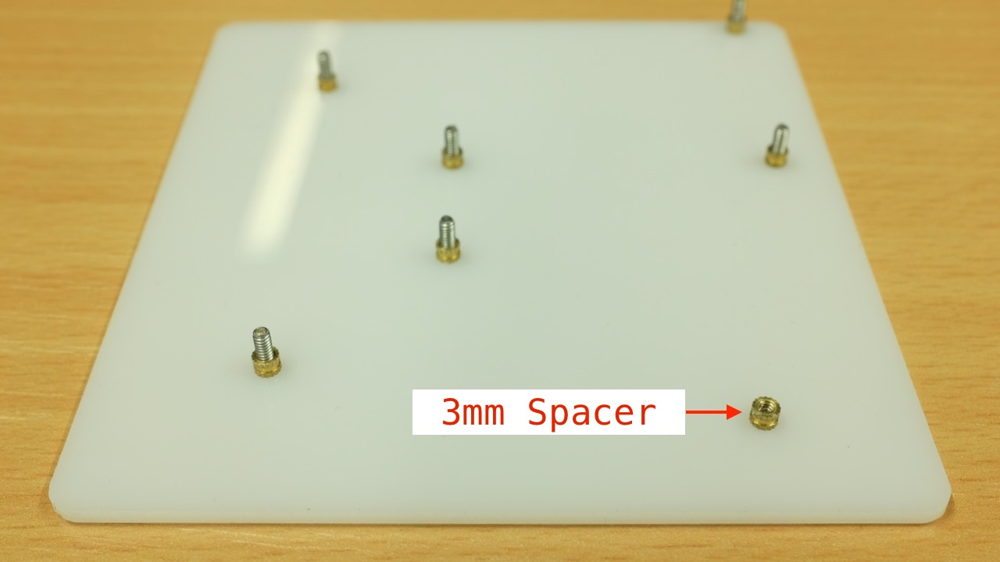

# duckyPad Assembly Guide

[Official Discord](https://discord.gg/4sJCBx5) | [Pre-order on Tindie!](https://www.tindie.com/products/21984/) | [Getting Started](getting_started.md) | [Table of Contents](#table-of-contents)

------

Thanks for purchasing duckyPad! Here is a short guide on how to put everything together.

## Recommended Tools

A small Phillips-head screwdriver (`+`shape) is needed, there should be one provided in the package.

A pair of pliers would make tightening the fasteners easier, but by no means required. You can use your hand just fine.

## Handling Bare Circuit Boards

When handling the bare circuit board, remember to:

* Wash your hands first

* Always hold the circuit board by its edge

* Don't touch the components

The reason for hand-washing is to reduce the risk of static electricity(SE) on your body zapping the board and damage it, especially in dry weather.

By washing your hands, you release the existing SE through the metal water pipe, your hands are moist to prevent further SE build-up, and your clean hands won't leave greasy fingerprints all over the place, win-win-win!

Of course, your hands can't be dripping wet either, but that's just common sense.

## Assembly Steps

By now, you should have:

* 1x duckyPad circuit board

* 1x Front Plate

* 1x Back Plate

* 15x Cherry MX-style switches

* 15x Keycaps

* 4x Silicone Anti-slip Pad

* Fasteners

* microSD Card

You should have the following fasteners:

* 6x `8mm Screw`

* 8x `2.8mm Screw`

* 7x `2mm Standoff`

* 6x `4mm Standoff`

Be careful while handling them, if you drop one you'll never find it again!

Probably safer to leave them in the bag for now.

Start by peeling off the protective cover on the front and back plate:

Place the `Back Plate` in front of you like this. Note the orientation of the holes:

Start from a hole in the middle, put a `8mm Screw` through the back side:

Then screw on the `2mm Standoff`.

Don't over-tighten! Doing so might deform or crack the acrylic plate.

Finger-tight is OK, just make sure it's not loose and doesn't rattle.

Do the same with all the holes **`EXCEPT the bottom right`**:

Put a `2.8mm Screw` through that one:

And install the `2mm Standoff`.

This is gonna be a PITA, but you'll eventually get it :) Careful not to drop the small parts. 

Now go wash your hands, grab the circuit board by its edge, line up and install as shown:

Then install all 6 `4mm Standoffs`, moderately tighten.

Also install the `2.8mm Screw` on the lower right.

Line up the `Front Plate`, and install the `2.8mm Screws`.

**`DO NOT`** tighten each screw as you install it! Put them all on loosely first, then tighten them one-by-one.

This ensures the plate is properly lined up. Again, don't over-tighten.

Flip it over, clean the plate with a dry cloth if dirty, and stick on the anti-slip pads on each corner:

Time to install the switches! duckyPad supports hot-swap, so no soldering is needed. 

Make sure the pins are straight, then line up with the holes, gently push until it clicks in place:

Keycaps next! Note the orientation ("slope" side pointing left in this photo). Just push it down.

All the keys should be lined up evenly. If not, try push down or wiggle it a little.

Finally, if it hasn't already been done, peel off the protective cover on the OLED screen:

And you're done! Congratulations!

Head on down to the [Quick Start Guide](/getting_started.md) to see how to use it.

## Table of Contents

[Main page](README.md)

[Getting Started Guide](getting_started.md)

[Kit Assembly Guide](kit_assembly_guide.md)

[Using duckyScript](duckyscript_info.md)

[Common issues / Troubleshooting](troubleshooting.md)

[Firmware Updates and Version History](firmware_updates_and_version_history.md)

[Make Your Own Keymap](./keymap_instructions.md)

[Manual Setup](./manual_setup.md)

[Build a duckyPad Yourself](build_it_yourself.md)

[Kickstarter Backer Acknowledgments](kickstarter_backers.md)

## Questions or Comments?

Please feel free to [open an issue](https://github.com/dekuNukem/duckypad/issues), ask in the [official duckyPad discord](https://discord.gg/4sJCBx5), DM me on discord `dekuNukem#6998`, or email `dekuNukem`@`gmail`.`com` for inquires.
