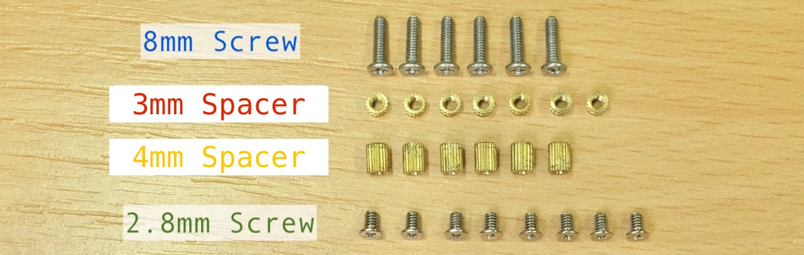

# duckyPad Assembly Guide

[Get duckyPad](https://www.tindie.com/products/21984/) | [Official Discord](https://discord.gg/4sJCBx5) | [Getting Started](getting_started.md) | [Table of Contents](#table-of-contents)

------

Thanks for getting duckyPad!

Here's how to put everything together.

## Join Our Discord!

Feel free to join our [Official Discord](https://discord.gg/4sJCBx5) for discussions, asking questions, sharing scripts, and latest updates!

## Tools

A small **Phillips-head screwdriver** (`+`shape) should be provided in the package.

A socket bit or **pair of pliers** also helps, but not required.

## Assembly Steps

You should have the following items:

And the following fasteners:

* 6x `8mm Screw`

* 8x `2.8mm Screw`

* 7x `3mm Spacer`

* 6x `4mm Spacer`

Pay special attention to the **brass spacers**!

* One is **slightly shorter** than the other.

* Separate them out before starting, don't mix them up!

Start by peeling off the protective cover on the front and back plate:

Place the `Back Plate` in front of you like this. Note the orientation of the holes:

Start from a hole in the middle, put a `8mm Screw` through the back side:

Then screw on the `3mm Spacers`.

Don't over-tighten! Doing so might deform or crack the acrylic plate.

Finger-tight is OK, just make sure it's not loose and doesn't rattle.

Do the same with all the holes **`EXCEPT the bottom right`**:

Put a `2.8mm Screw` through that one:

And install the `3mm Spacers`.

**Wash your hands** to discharge static electricity.

Grab the circuit board by its edge, line up and install as shown:

Then install all six `4mm Spacers`, moderately tighten.

Also install the `2.8mm Screw` on the lower right.

Line up the `Front Plate`, and install the `2.8mm Screws`.

**`DO NOT`** tighten each screw as you install it! Put them all on loosely first, then tighten them one-by-one.

This ensures the plate is properly lined up. Again, don't over-tighten.

Flip it over, clean the plate with a dry cloth if dirty, and stick on the anti-slip pads on each corner:

Time to install the switches! duckyPad supports hot-swap, so no soldering is needed. 

* **Make sure the pins are straight!**

* **Make sure the pins are straight!** 

* **Make sure the pins are straight!**, otherwise you might damage the circuit board or the switch itself!

Then **line up with the holes**, and **`gently push straight down`** until it clicks in place:

Keycaps next! Note the orientation ("slope" side pointing left in this photo). Just push it down.

All the keys should be lined up evenly. If not, try push down or wiggle it a little.

Finally, if it hasn't already been done, peel off the protective cover on the OLED screen:

And you're done! Congratulations!

Head on down to the [Quick Start Guide](/getting_started.md) to see how to use it.

## Table of Contents

[Main page](README.md)

[Getting Started Guide](getting_started.md)

[Kit Assembly Guide](kit_assembly_guide.md)

[Using duckyScript](duckyscript_info.md) | [duckyScript 3 Info](duckyscript3_instructions.md)

[Common issues / Troubleshooting](troubleshooting.md)

[Firmware Updates and Version History](firmware_updates_and_version_history.md)

[Make Your Own Keymap](./keymap_instructions.md)

[Build a duckyPad Yourself](build_it_yourself.md)

[Kickstarter Backer Acknowledgments](kickstarter_backers.md)

## Questions or Comments?

Please feel free to [open an issue](https://github.com/dekuNukem/duckypad/issues), ask in the [official duckyPad discord](https://discord.gg/4sJCBx5), DM me on discord `dekuNukem#6998`, or email `dekuNukem`@`gmail`.`com` for inquires.
