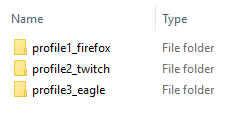
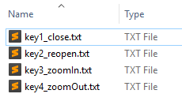
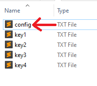

# Configure duckyPad Manually

[Official Discord](https://discord.gg/4sJCBx5) | [Pre-order on Tindie!](https://www.tindie.com/products/21984/) | [Getting Started](getting_started.md) | [Table of Contents](#table-of-contents)

------

If you don't trust or unable to run the software, you can also configure duckyPad manually with a text editor.

### Step 1: Preparing Profiles

A *Profile* contains a group of scripts corresponding to the keys on the duckyPad. Usually you want to set up one profile per program you want to control.

Profiles are created as folders at the **root level** of the SD card. They have naming conventions like `profile#_name`, where `#` is the profile number, and `name` being the name of the profile.

If you mount the SD card on your computer, you might see some examples like these:



[Existing examples](https://github.com/dekuNukem/duckypad/raw/master/sample_profiles.zip) are an excellent starting point of making your own profiles and scripts.

Up to 32 profiles are supported.

### Step 2: Preparing Scripts

Now you're ready to write some scripts inside the profile folders. The script used in this project is Duckyscript, [read more about it here](duckyscript_info.md).

Each key has its own script file, named like `key#.txt`, where `#` is the key number(top left is 1, bottom right is 15). 

Here are some examples:



* Might be helpful to take a look at the [sample profiles](https://github.com/dekuNukem/duckypad/raw/master/sample_profiles.zip) before writing your own

### Step 3: Key Names and Optional Parameters

Create a file named `config.txt` in a profile folder like this:



#### Key Names

In the `config.txt`, list the names of your keys like this:

```
z1 prev
z2 next
z3 close
z4 reopen
....
z15 save
```
* The screen will only display the **first 7 characters** of the key name, so keep it short!

#### Backlight Colors

To set your custom background color, add the following line:

```
BG_COLOR 255 100 0
```

The number should be between 0 and 255, in the order of R-G-B.

* Can't decide? Use [this website](https://www.w3schools.com/colors/colors_picker.asp) to try some out. Use the `rgb()` value of each colour.

If unspecified, the default background color would be light purple.

#### Key-down Colors

To set the color of a key to change into when pressed, add the following line in `config.txt`:

```
KEYDOWN_COLOR 100 0 255
```

If unspecified, the default key-down color would be the inverse of background color.

#### Dim Unused Keys

By default unused keys are dimmed. If you want everything to light up, add the following line in `config.txt`:

```
DIM_UNUSED_KEYS 0
```

#### Individual Key Colors

You can also assign colors to individual keys, this will override the background color above.

Just add lines in `config.txt` for the keys you want like this:

```
SWCOLOR_1 148 0 211
SWCOLOR_2 148 0 211
SWCOLOR_3 148 0 211
SWCOLOR_4 0 0 255
SWCOLOR_5 0 0 255
SWCOLOR_6 0 0 255
SWCOLOR_7 0 255 0
SWCOLOR_8 0 255 0
SWCOLOR_9 0 255 0
SWCOLOR_10 255 255 0
SWCOLOR_11 255 255 0
SWCOLOR_12 255 255 0
SWCOLOR_13 255 0  0
SWCOLOR_14 255 0  0
SWCOLOR_15 255 0  0
```

### Step 4: Run it!

Just like before, make sure the SD card is in FAT32 format, copy all the profile folders to the root of the SD card (if they are not already there), insert it in your duckyPad, and power on.

duckyPad should start up and display the profile names and key names, as well as the background color.

Press the corresponding keys to execute the scripts, if there is an error it will show up on the screen.

Press +/- button to change profiles.

## Table of Contents

[Main page](README.md)

[Getting Started Guide](getting_started.md)

[Kit Assembly Guide](kit_assembly_guide.md)

[Using duckyScript](duckyscript_info.md)

[Firmware Updates and Version History](firmware_updates_and_version_history.md)

[Make Your Own Keymap](./keymap_instructions.md)

[Manual Setup](./manual_setup.md)

[Build a duckyPad Yourself](build_it_yourself.md)

## Questions or Comments?

Please feel free to [open an issue](https://github.com/dekuNukem/duckypad/issues), ask in the [official duckyPad discord](https://discord.gg/4sJCBx5), DM me on discord `dekuNukem#6998`, or email `dekuNukem`@`gmail`.`com` for inquires.