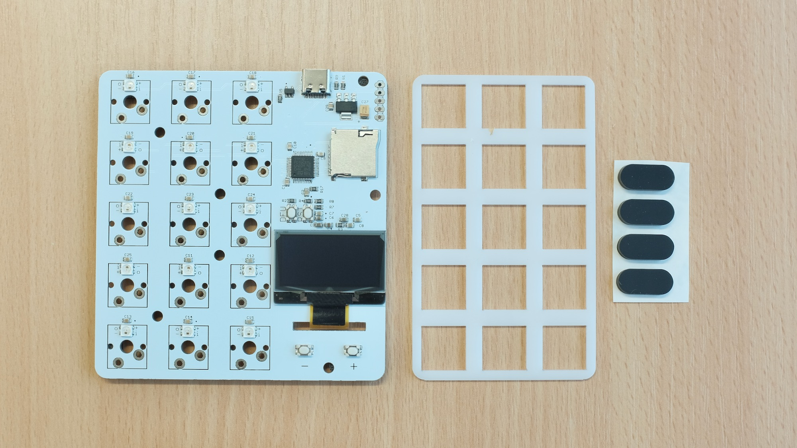
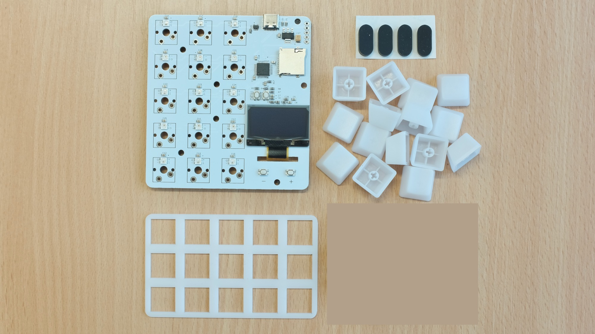
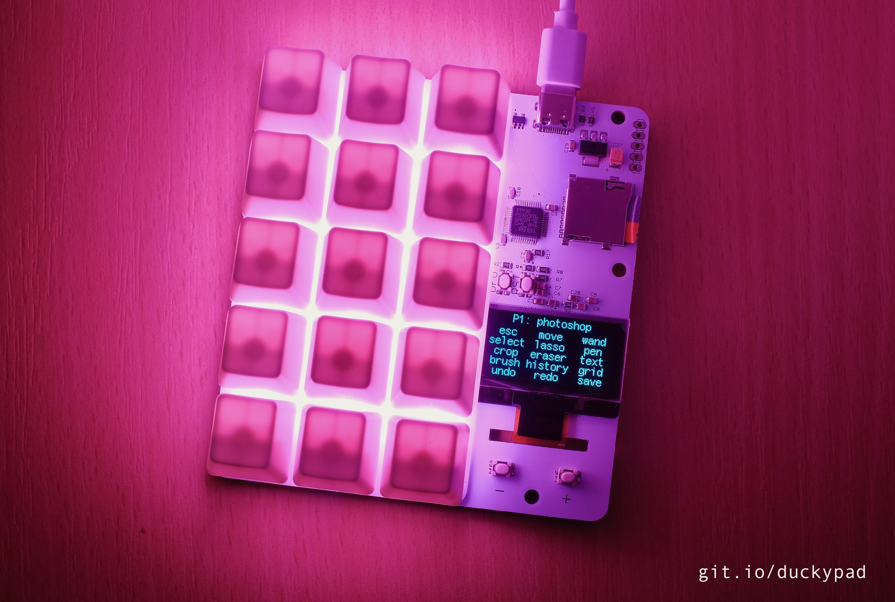
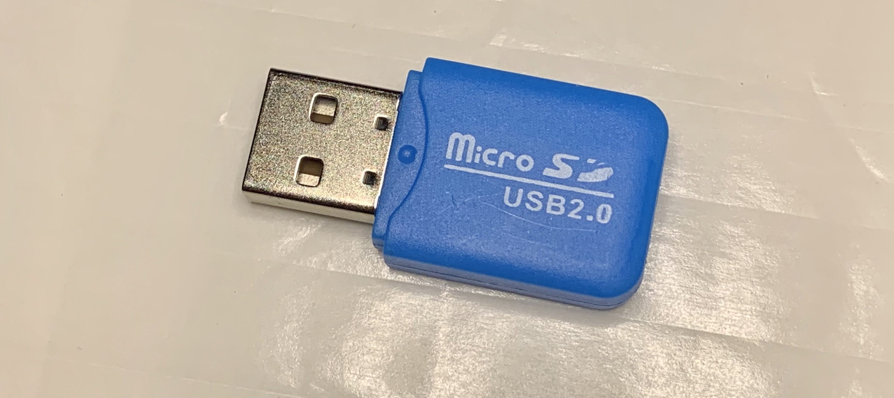
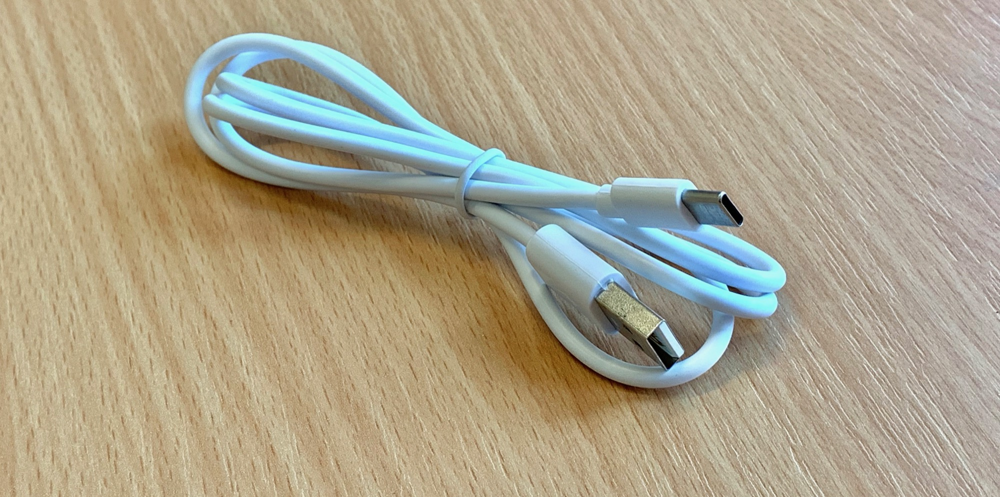

# Purchasing a duckyPad

[Main Page](/README.md)

------

Thanks for considering supporting this project!

I was actually planning a kickstarter earlier this year, but with the coronavirus situation, launching a campaign right now doesn't seem to be the best timing.

Still, I do have **around 30 duckyPads in stock** from a test production run, and you can purchase one directly from me.

Those circuit boards are professionally machine-assembled by a PCB fab house, and are fully tested.

## Options and Pricing

All pricing in **`US Dollar`**.

All tiers are currently **`IN STOCK`**.

### Tier 1: Circuit Board Only - $55

* 1x Complete circuit board
* 1x Switch plate
* 4x Rubber feet
* MicroSD card (not pictured)
* $55
* Soldering required

This tier **does not** come with switches or keycaps, so you can solder on your own Cherry-MX style switches.

This tier **DOES** come with a microSD card.

### Tier 2: Circuit Board + Keycaps - $60

* 1x Complete circuit board
* 1x Switch plate
* 4x Rubber feet
* 15x Blank ABS R4 Translucent keycaps
* MicroSD card (not pictured)
* $60
* Soldering required

This tier comes with 15 translucent keycaps, but **NO** switches. You can solder on your own cherry-MX style switches.

This tier **DOES** come with a microSD card.

### Tier 3: Circuit Board + Keycaps + Switches - $69

* 1x Complete circuit board
* 1x Switch plate
* 4x Rubber feet
* 15x **Gateron Green** mechanical switches
* 15x Blank ABS R4 Translucent keycaps
* MicroSD card (not pictured)
* $69
* Soldering required

This tier comes with 15 **Gateron Green** mechanical switches and 15 translucent keycaps. All you need to do is solder them on.

This tier **DOES** come with a microSD card.

### Tier 4: Fully Assembled - $79

* Fully assembled and tested
* Ready to use out-of-box
* MicroSD card (not pictured)
* $79

This tier is fully assembled and ready to use out-of-box.

This tier **DOES** come with a microSD card.

## Optional Accessories

### microSD Card Reader - $2

* Slightly crappy microSD card reader.

* Works fine in Windows, doesn't seem to work in macOS.

* $2

### USB-C cable - $3

* USB-A to USB-C, 1m (3.3ft) in length

* $3

## Shipping

Two shipping options are available from United Kingdom:

### 1: Royal Mail International Standard - $5

* $5
* Not tracked
* Usually arrive in 2 weeks

### 2: Royal Mail International Tracked & Signed - $10

* $10
* Tracked & Signed
* Usually arrive in 2 weeks

## Transaction

* Choose the desired tier, accessories, and shipping.

* Use **Paypal** to transfer the appropriate amount to `dekuNukem`@`gmail`.`com`

* Leave a note about your **chosen tier**, **optional accessories**, **shipping preference**, and **shipping address**.

Questions or comments? You can reach me with the same email, and I'll do my best to help.

## Getting Started

After receiving your duckyPad, please see [this guide](./getting_started.md) on how to use it.

## Feedback Wanted!

If you do get one, I'd love to hear how you think of this product.

Your feedback would be immensely helpful in improving this project for a wider launch!

## Questions or Comments?

Please feel free to [open an issue](https://github.com/dekuNukem/duckypad/issues), or email `dekuNukem`@`gmail`.`com` for inquires.
