# Common Issues / Troubleshooting

[Get duckyPad](https://dekunukem.github.io/duckyPad-Pro/doc/landing.html) | [Official Discord](https://discord.gg/4sJCBx5) | [Getting Started](getting_started.md) | [Table of Contents](#table-of-contents)

----

A couple of commonly encountered issues are explained here.

Click a question below to jump to the answer!

* [I press a key and nothing happens!](#I-press-a-key-and-nothing-happens)

* [The letters and symbols come out wrong!](#The-letters-and-symbols-come-out-wrong)

* [F13 - F24 keys doesn't work!](#f13---f24-keys-doesnt-work)

* [My duckyPad stopped working on latest firmware!](#my-duckypad-stopped-working-on-latest-firmware)

* [My script behaves inconsistently!](#My-script-behaves-inconsistently)

* [My duckyPad seems to be getting sluggish!](#My-duckyPad-seems-to-be-getting-sluggish)

* [I want to use my own SD card!](#i-want-to-use-my-own-sd-card)

* [The RGB backlight is flickering slightly!](#The-RGB-backlight-is-flickering-slightly)

* [The RGB backlight is too bright!](#The-RGB-backlight-is-too-bright)

* [The OLED screen isn't working properly!](#the-oled-screen-isnt-working-properly)

* [Will the OLED suffer burn-in?](#Will-the-OLED-suffer-burn-in)

* [Numpad keys doesn't work!](#Numpad-keys-doesnt-work)

* [SD Card doesn't work on mac!](#SD-Card-doesnt-work-on-mac)

* [USB configuration / Autoswitcher isn't working on macOS!](#usb-configuration--autoswitcher-isnt-working-on-macos)

## Join Our Discord!

If you have some issues that's not in this list, feel free to join our [Official Discord](https://discord.gg/4sJCBx5) to ask about it! We also have discussions, script sharing, and latest updates!

----

## I press a key and nothing happens!

First, make sure the key has a valid script mapped to it. If in doubt, use one of the sample profiles.

### Just updated firmware?

Use the [latest configurator](https://github.com/dekuNukem/duckyPad/releases/latest), press `Connect` to load up the data, then press `Save` button to save it back. It should work afterwards.

### If *none* of the keys work

* Check that the cable is plugged all the way in.

* Try a different cable.

* Try a different USB port.

* Try plugging it directly into a computer instead of through a USB hub.

* Try a different computer.

### If a certain key doesn't work

Take off the switch and inspect the pins, chances are one of them is bent:

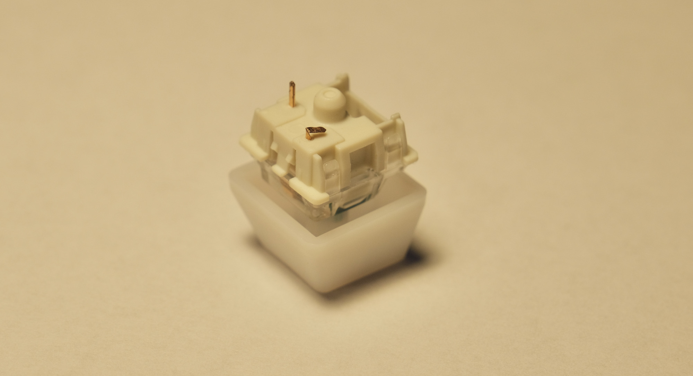

If so, straighten it up with a pair of pliers, then insert again. Make sure the **pins are straight** and aim for hot-swap socket holes.

## Letters and symbols come out wrong!

You need select the correct keyboard layout.

* **`HOLD DOWN TOP LEFT KEY`** while **`plugging it in`**.

* Select a keyboard layout.

* Read more about [adding keyboard layouts](getting_started.md#keyboard-layouts) and [writing keymaps](keymap_instructions.md).

## F13 - F24 Keys doesn't work!

Please [update your duckyPad to the latest firmware](https://github.com/dekuNukem/duckyPad/blob/master/firmware_updates_and_version_history.md) to fix this issue.

## My duckyPad stopped working on latest firmware!

If your duckyPad fails to work after updating to latest firmware (0.18.0+), you are most likely affected by a USB chipset bug on recent AMD motherboards.

[Take a look at this article for possible solutions](https://www.tomshardware.com/uk/news/amd-suggest-possible-fixes-for-usb-connectivity-issues). You can also plug it in through a USB hub, which should work.

## My script behaves inconsistently!

duckyPad might be typing too fast for your computer.

You can slow it down by using `DELAY` commands.

* `DELAY n` adds an arbitrary delay in milliseconds.

* `DEFAULTDELAY n` sets the amount of time to wait between **`each line`** of command.

* `DEFAULTCHARDELAY n` sets the amount of time to wait between **`each keystroke`**.

* [More info here](duckyscript_info.md#defaultdelay)

## My duckyPad seems to be getting sluggish!

If your duckyPad is getting slower at starting up and switching profiles, it's usually because of the SD card fragmentation.

* Make a backup of the files on SD card.

* Format it in [FAT32 or FAT](resources/pics/format.PNG).

* Copy the files back, it should be much faster now.

You can also use your [own faster SD card](#i-want-to-use-my-own-sd-card).

## I want to use my own SD card!

* (Optional) Make a backup of the contents of the original SD card.

* Format the new SD card in `FAT or FAT32`:

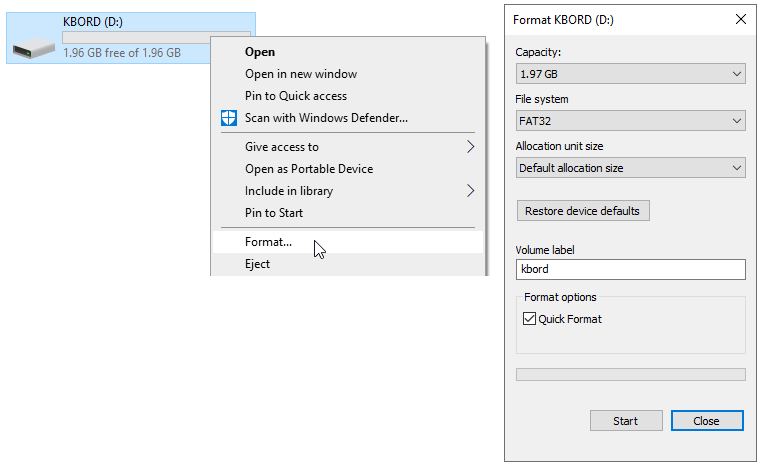

* Copy all the files back.

* You can also download the [sample profiles](https://github.com/dekuNukem/duckyPad/raw/master/sample_profiles.zip) and copy everything to the **root of your SD card**:

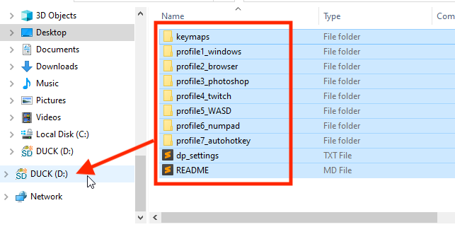

## The RGB backlight is flickering slightly!

* Make sure the USB port can provide enough power.

* Try plugging it directly into the computer, instead of through a USB hub.

* Also try a different cable if possible.

## The RGB backlight is too bright!

* You can adjust the brightness by **holding down `-` button**.

## Will the OLED suffer burn-in?

Measures have been taken to prevent OLED burn-in.

* The screen dims after 5 minutes.

* duckyPad goes to sleep after 30 minutes ([adjustable](getting_started.md#settings--updates)).

## The OLED screen isn't working properly!

If your OLED screen is acting weird, you might want to try to re-seat its ribbon cable.

* Disassemble until you can remove the circuit board. You can [follow this in reverse](kit_assembly_guide.md).

* Locate the tabs on the ribbon cable connector:

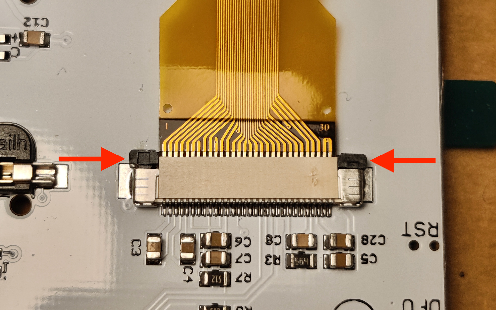

* Push it outwards **gently** to loosen the tab:

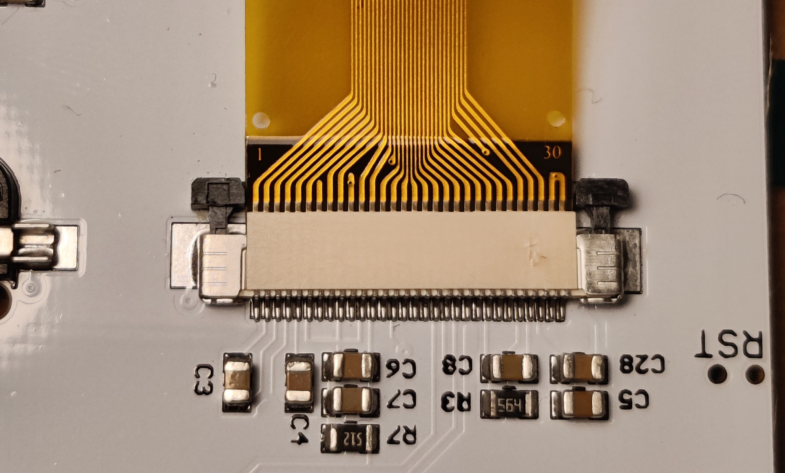

* Pull out the ribbon cable, and wipe the golden contacts with a dry cloth.

* Use a **DRY** toothbrush (or similar) and gently clean the pins on the connector. 

* Insert the ribbon cable back, make sure it is even and all the way in. Look at the above photos for reference.

* Push the tab back in to lock in place.

* Try it out, if it still doesn't work, [let me know](#questions-or-comments)!

## Numpad keys doesn't work!

Make sure your `NUM LOCK` is on.

## SD Card doesn't work on mac!

If macOS doesn't like your SD card, you can reformat it in FAT/FAT32 in macOS itself, then it should work.

Click `Initialize...`:

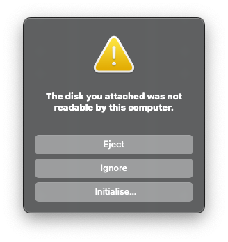

In `Disk Utility`, select `Erase`, then `MS-DOS (FAT)`:

Now the card should be readable in both macOS and duckyPad.

If you want, you can copy the [sample profiles](https://github.com/dekuNukem/duckyPad/raw/master/sample_profiles.zip) back to the root of the SD card.

## USB configuration / Autoswitcher isn't working on macOS!

Due to the security restrictions of macOS, to use USB configuration and autoswitcher, you need to:

* Enable "Input Monitoring" permission (for loading from USB)

* Enable "Screen Recording" permission (for reading window titles)

* Run the app as root

### Enable permission

* Open `System Preferences` -> `Security & Privacy`

* Select `Input Monitoring`

* Click the lock to make changes

* Press the `+` button

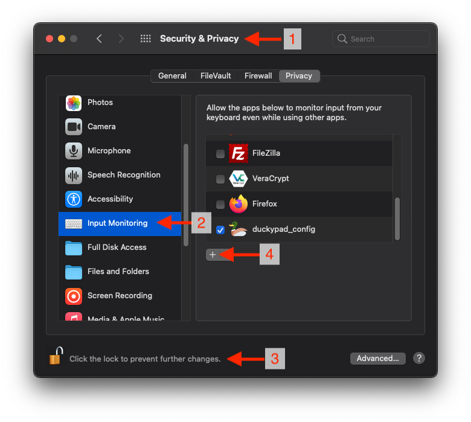

* Go to `Applications` -> `Utilities`, and add `Terminal` to the list.

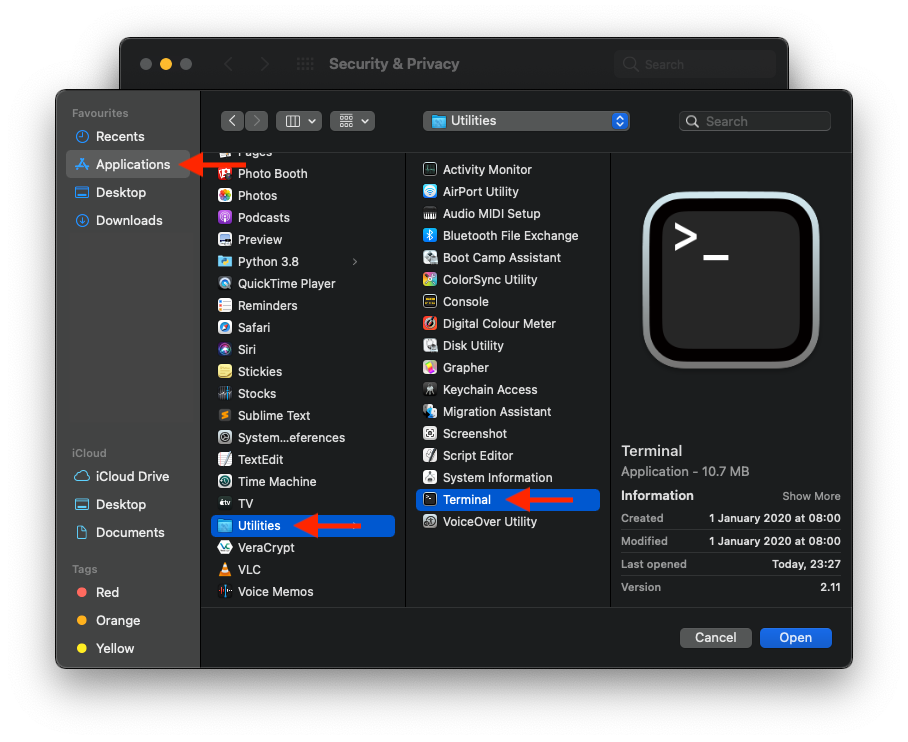

* Select `Screen Recording`, and repeat the same process

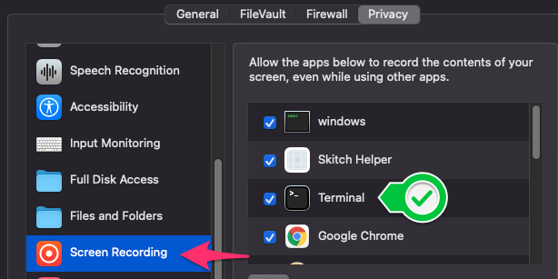

### Launch app as administrator

* Open `System Preferences` -> `Keyboard` -> `Shortcuts` -> `Services`

* Tick `New Terminal at Folder`

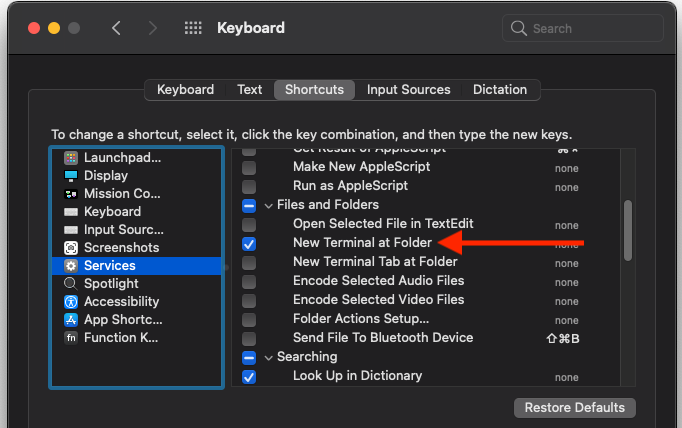

* Download the latest macOS software, unzip into a folder.

* `Right click` on the unzipped folder and select `New Terminal at Folder`

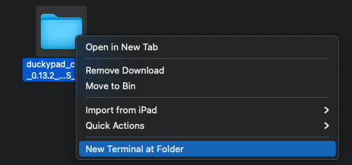

* Type in `sh run.sh` and press enter, then enter your password.

* The app should launch as administrator, and should be fully functional now.

* If it still doesn't work, [let me know](#questions-or-comments)!

## Table of Contents

[Main page](README.md)

[Getting Started Guide](getting_started.md)

[Kit Assembly Guide](kit_assembly_guide.md)

[Using duckyScript](duckyscript_info.md)

[Common issues / Troubleshooting](troubleshooting.md)

[Firmware Updates and Version History](firmware_updates_and_version_history.md)

[Make Your Own Keymap](./keymap_instructions.md)

[Build a duckyPad Yourself](build_it_yourself.md)

[Kickstarter Backer Acknowledgments](kickstarter_backers.md)

## Questions or Comments?

Please feel free to [open an issue](https://github.com/dekuNukem/duckypad/issues), ask in the [official duckyPad discord](https://discord.gg/4sJCBx5), DM me on discord `dekuNukem#6998`, or email `dekuNukem`@`gmail`.`com` for inquires.
